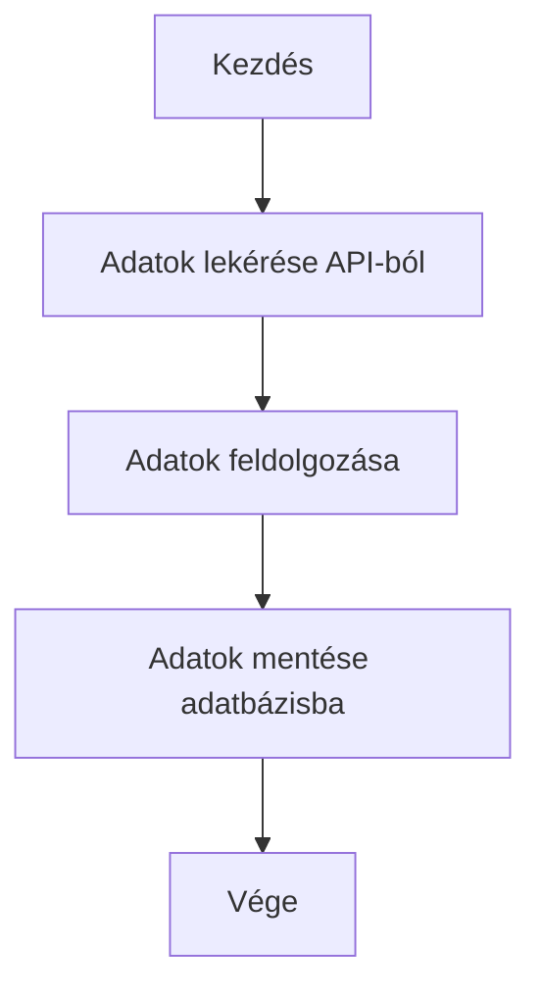
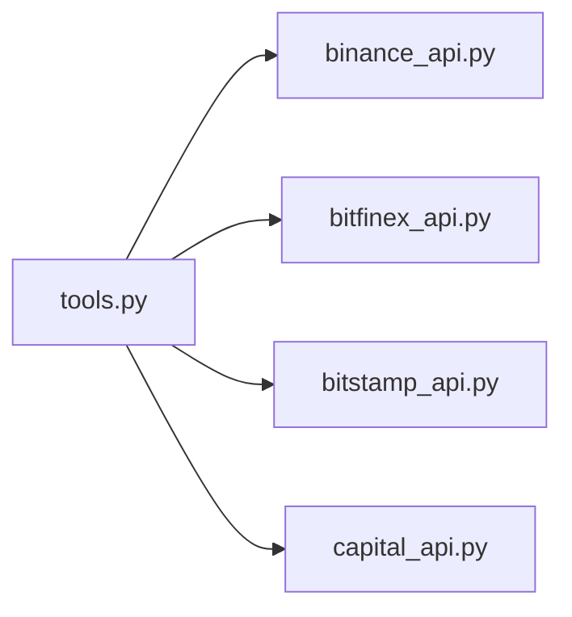
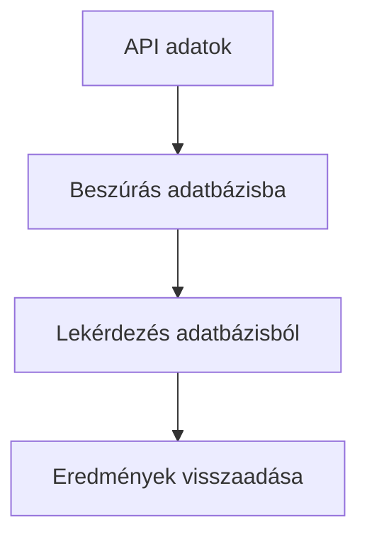

# RC Smarti Me Dokumentáció

## Projekt Áttekintés

Az RC Smarti Me egy Python-alapú projekt, amely több pénzügyi API-val (Binance, Bitfinex, Bitstamp, Capital) kommunikál valós idejű adatok lekérésére, feldolgozására és adatbázisba mentésére. Eszközöket biztosít naplózáshoz, hibakezeléshez és adatbázis-kezeléshez, ezzel biztosítva a zökkenőmentes integrációt és az adatok megbízhatóságát.

A projekt ideális fejlesztők és pénzügyi elemzők számára, akik valós idejű pénzügyi adatokkal dolgoznak és történeti elemzéseket végeznek.

**Felhasznált technológiák:** `Python, MySQL, Binance, Bitfinex, Bitstamp és Capital API-k.`

---

## Telepítési Útmutató

### Előfeltételek

- Python 3.8 vagy újabb
- MySQL adatbázis
- `pip` a függőségek kezeléséhez

### Lépések

1. **Kód letöltése:**
    ```bash
    git clone https://github.com/username/rc.smarti.me.git
    cd rc.smarti.me
    ```
2. **Függőségek telepítése:**
    ```bash
    pip install -r requirements.txt
    ```
3. **Környezeti változók beállítása:**
    - Hozz létre egy `.env` fájlt a gyökérkönyvtárban az alábbi tartalommal:
    ```
    WEBHOOK_URL             =       <discord_webhook_urlod>
    MYSQL_HOST              =       <adatbázis_host>
    MYSQL_USER              =       <adatbázis_felhasználó>
    MYSQL_PASSWORD          =       <adatbázis_jelszó>
    MYSQL_DATABASE_RATES    =       <adatbázis_név>
    CAPITAL_API_KEY         =       <capital_api_kulcs>
    CAPITAL_IDENTIFIER      =       <capital_azonosító>
    CAPITAL_PASSWORD        =       <capital_jelszó>
    CAPITAL_WATCHLIST_ID    =       <watchlist_id>
    ```
4. **(Opcionális) Virtuális környezet létrehozása:**
    ```bash
    python -m venv venv
    source venv/bin/activate
    ```

---

## Használat

### Projekt futtatása

API-adatok lekéréséhez és adatbázisba mentéséhez:
```bash
python main.py
```

### API elérhetőség tesztelése

Binance API elérhetőségi teszt futtatása:
```bash
python binance_api/uptime_test.py
```

#### Példa kimenet

```json
{
    "symbol": "BTCUSDT",
    "price": "35000.00"
}
```

---

## Mappák és Fájlok Felépítése

```
.
├── allratesinput
│   ├── credentials.py
│   ├── logging_config.py
│   ├── tools.py
├── binance_api
│   ├── binance_api.py
│   ├── uptime_test.py
├── bitfinex_api
│   ├── bitfinex_api.py
├── bitstamp_api
│   ├── bitstamp_api.py
├── capital_api
│   ├── capital_api.py
├── requirements.txt
├── main.py
└── .env
```

**Magyarázat:**
- `allratesinput`: Közös segédfüggvények, naplózás és hitelesítési adatok kezelése.
- `binance_api`: Binance API-val való kommunikáció.
- `bitfinex_api`: Bitfinex API-val való kommunikáció.
- `bitstamp_api`: Bitstamp API-val való kommunikáció.
- `capital_api`: Capital API-val való kommunikáció.
- `requirements.txt`: Python függőségek listája.
- `main.py`: A projekt belépési pontja.
- `.env`: Környezeti változók tárolása.

---

## Függvények és Metódusok

### Közös függvények

- `setup_logging(info_log_path, error_log_path, debug=False, name="")`: Naplózás konfigurálása forgó fájlkezelőkkel.
- `add_pid_to_file(filename, pid, path)`: Folyamat-azonosítók tárolása fájlban.
- `send_message_to_dc(webhook_url, message_content, logger)`: Üzenet küldése Discordra webhook segítségével.
- `send_msg_on_socket(msg, port, file_path, pid)`: Formázott üzenet küldése socketen keresztül hibakezeléshez.
- `format_date_time(now_date_secs)`: Dátum/idő formázása `datetime` objektummá.
- `log_elapsed_time(logger)`: Dekorátor a függvény futási idejének naplózásához.
- `retry(max_retries, initial_delay, backoff_factor, exceptions, logger)`: Dekorátor újrapróbálkozáshoz exponenciális késleltetéssel.

### API-specifikus függvények

- `get_data_from_binance(url, params)`: Adatok lekérése a Binance API-ból.
- `get_data_from_bitfinex(url, headers)`: Adatok lekérése a Bitfinex API-ból.
- `get_data_from_bitstamp(url, headers)`: Adatok lekérése a Bitstamp API-ból.
- `get_data_from_capital(security_token, cst, watchlist_id)`: Adatok lekérése a Capital API-ból.
- `insert_data_into_db(data, time_as_date_time, instrument_name)`: Lekért adatok beszúrása az adatbázisba.

---

## Architektúra

### Folyamatábra



### Komponensek kapcsolata



### Adatbázis műveletek



---

## Funkciók

- Valós idejű pénzügyi adatok lekérése a Binance, Bitfinex, Bitstamp és Capital API-król.
- Adatok tárolása MySQL adatbázisban történeti elemzéshez.
- Hibák naplózása és értesítés Discordon.
- Sikertelen műveletek automatikus újrapróbálása.
- Moduláris felépítés, könnyen bővíthető további API-kkal.

---

## Hozzájárulás

Szívesen fogadunk hozzájárulásokat! Lépések:

1. Forkold a repót.
2. Hozz létre egy új branch-et:
    ```bash
    git checkout -b feature-name
    ```
3. Commitold a változtatásokat:
    ```bash
    git commit -m "Add feature-name"
    ```
4. Töltsd fel a saját forkodra:
    ```bash
    git push origin feature-name
    ```
5. Küldj pull requestet.

**Hozzájárulási területek:**
- Dokumentáció fejlesztése
- Új API-k támogatása
- Adatbázis műveletek optimalizálása
- Hibakezelés és naplózás fejlesztése

---

## Tesztelés

Egységtesztek futtatása a funkcionalitás ellenőrzéséhez:
```bash
python -m unittest discover tests
```
Várható kimenet:
```
Ran 10 tests in 0.05s
OK
```

---

## GYIK

- **Mi történik, ha egy API hibát jelez?**  
  A projekt automatikusan újrapróbálja a sikertelen műveleteket a `retry` dekorátorral.

- **Hogyan adhatok hozzá új API-t?**  
  Hozz létre egy új mappát az API-nak, implementáld az adatlekérő metódusokat, és integráld a `tools.py`-ba.

- **Mit tegyek, ha az adatbázis kapcsolat sikertelen?**  
  Ellenőrizd a környezeti változókat és győződj meg róla, hogy a MySQL szerver fut.

---

## Licenc

A projekt az MIT licenc alatt érhető el. Részletekért lásd a `LICENSE` fájlt.

---

## Kapcsolat

Kérdés vagy támogatás esetén írj a következő címre: [your_email@example.com](mailto:your_email@example.com).