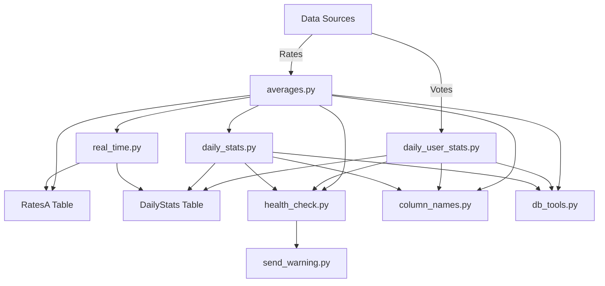
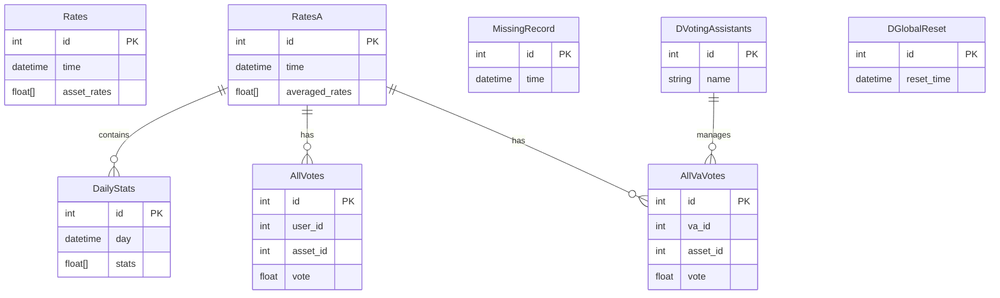
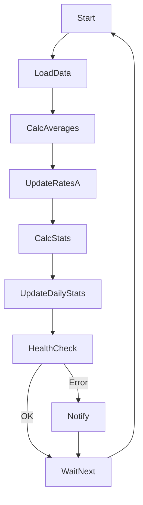

# DBR Project Documentation

## 1. Project Overview

The DBR project is a data analytics and processing system designed to aggregate, analyze, and report on financial asset rates and user voting data. Its main goal is to compute rolling averages, daily statistics, and optimal values for a set of tracked assets (such as oil, EUR, gold, BTC), while handling user input and ensuring data integrity. 

The system ingests raw rates and votes, processes them through a series of calculations, and stores results in a relational database. `Key concepts include assets, rates, DBR (Dynamic Base Rate), and user voting.` The data flows from ingestion, through averaging and statistics computation, to reporting and notification.

## 2. Architecture Diagram

## 3. Database Schema Diagram

## 4. Data Flow Description

1. New rate and vote data is ingested from external sources and stored in the database.
2. `averages.py` calculates rolling averages over recent samples and stores results in the `RatesA` table.
3. `daily_stats.py` computes daily statistics for each asset, including applied and optimal DBR values, and stores them in `DailyStats`.
4. `daily_user_stats.py` computes user-level statistics based on their votes and asset performance.
5. `real_time.py` manages real-time updates, ensuring the `RatesA` table is current and consistent, and triggers resets as needed.
6. Health checks and error handling modules detect missing or inconsistent data, log issues, and send notifications via Discord if necessary.

## 5. Core Classes and Functions

- **AveragePrecalculator**: Handles calculation and uploading of rolling averages to the database. Uses batch processing for efficiency and interacts with `RatesA`.
- **BaseAssetCalculator**: Computes daily statistics for each asset, such as gains and DBR values, using data from `RatesA`.
- **OptimalCalculator**: Determines optimal DBR values based on historical data and asset performance.
- **DailyUserStatCalculator**: Aggregates and analyzes user voting data, producing user-level statistics for reporting and analysis.
- **RTC (real-time controller)**: Orchestrates real-time updates, ensuring data freshness and consistency, and manages periodic resets.

## 6. Key Algorithms and Calculations

- **Rolling average calculation**: Uses a sliding window over time-series data to compute averages for each asset, smoothing out short-term fluctuations.
- **DBR calculation**: Computes the Dynamic Base Rate for assets, scaling and normalizing values as needed for fair comparison.
- **Daily gain and best vote statistics**: Aggregates daily performance metrics for assets and users, identifying top performers and trends.
- **Handling missing/late data**: Implements forward-filling and health checks to ensure data completeness and integrity.

## 7. Error Handling and Health Checks

- Detects missing or duplicate rows using custom exceptions and validation logic.
- Logs data issues and triggers notifications via `send_warning.py` for critical problems.
- Recovers from incomplete data by forward-filling or recalculating affected statistics.

## 8. Real-Time Processing Flow

## 9. Configuration and Constants

- **ASSET_NO**: Number of tracked assets (e.g., 4 for oil, EUR, gold, BTC).
- **SAMPLES**: Number of samples to average over for DBR calculation.
- **MyNAN**: Special value used to represent missing or invalid data in the database.
- **DBR_SCALE_VALUE**: Scaling factor for DBR values to ensure consistent units.

## 10. Logging and Notifications

Logging is set up using Python's `logging` module, with support for rotating file handlers. Critical issues are reported to project supervisors via Discord using the `send_warning.py` module, which sends HTTP POST requests to a configured webhook.

## 11. Extending and Maintaining the System

- To add new assets, update `ASSET_NO` and ensure all relevant tables and calculations handle the new asset columns.
- To change averaging logic, modify `AveragePrecalculator` and related functions.
- To integrate new notification channels, extend `send_warning.py` with additional endpoints.
- Maintain code quality by using modular design, thorough error handling, and regular health checks.
- Ensure data integrity by validating inputs and outputs at each processing stage.