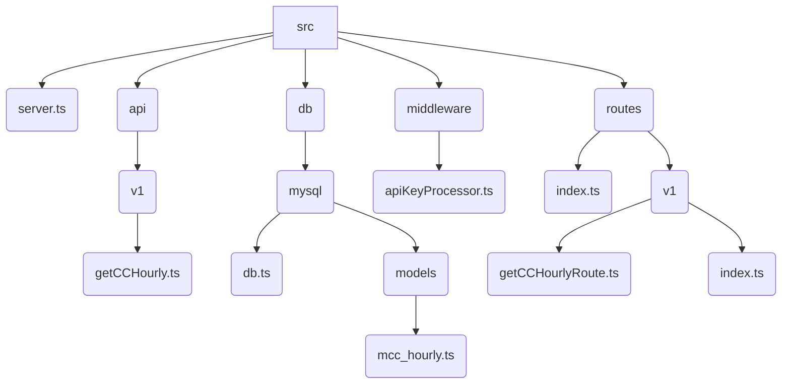
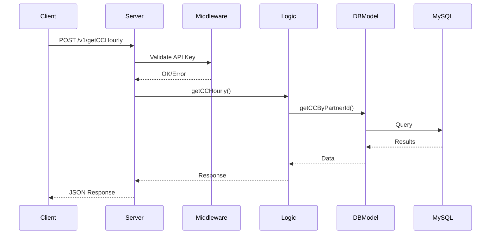
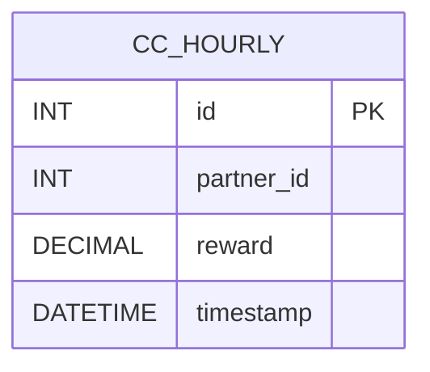

# DBRCoin API Server

## Overview

DBRCoin API Server is a `Fastify-based Node.js REST API` for retrieving hourly cryptocurrency reward data from a MySQL database. It is written in TypeScript, uses environment-based configuration, and enforces API key security.

## Technologies Used

- Node.js
- Fastify
- TypeScript
- MySQL (mysql2)
- dotenv

## Folder and File Structure

```plaintext
.env
package.json
tsconfig.json
startDBRCoin5100Api
startDBRCoin5100ApiDev
src/
  server.ts
  api/
    v1/
      getCCHourly.ts
  db/
    mysql/
      db.ts
      models/
        mcc_hourly.ts
  middleware/
    apiKeyProcessor.ts
  routes/
    index.ts
    v1/
      getCCHourlyRoute.ts
      index.ts
```

### Folder Descriptions

- **src/server.ts**: Main entry point, sets up Fastify server and routes.
- **src/api/v1/getCCHourly.ts**: Business logic for `/v1/getCCHourly` endpoint.
- **src/db/mysql/db.ts**: MySQL connection pool and query helpers.
- **src/db/mysql/models/mcc_hourly.ts**: Data access for `cc_hourly` table.
- **src/middleware/apiKeyProcessor.ts**: Middleware for API key validation.
- **src/routes/**: Route registration and organization.

## API Documentation

### `/v1/getCCHourly` (POST)

- **Headers:** `x-api-key: <API_KEY>`
- **Request Body:**  
  ```json
  { "partnerId": 123 }
  ```
- **Response:**  
  ```json
  {
    "success": true,
    "statusCode": 200,
    "data": { ... },
    "infoList": [],
    "errors": []
  }
  ```

#### Example Request

```bash
curl -X POST http://localhost:5100/v1/getCCHourly \
  -H "x-api-key: your_api_key" \
  -H "Content-Type: application/json" \
  -d '{"partnerId": 123}'
```

## Database Schema

The `cc_hourly` table stores hourly reward data for partners.

| Column      | Type    | Description                |
|-------------|---------|----------------------------|
| id          | INT     | Primary key                |
| partner_id  | INT     | Partner identifier         |
| reward      | DECIMAL | Reward amount              |
| timestamp   | DATETIME| Hourly timestamp           |

## Security

- All endpoints require a valid API key via the `x-api-key` header.
- Database credentials and the API keys are stored in `.env`.

## Configuration

Set the following in your `.env` file:

```
DB_HOST             =   <database_host>
DB_USER             =   <database_user>
DB_PASSWORD         =   <database_password>
DB_DATABASE         =   <database_name>
API_KEY             =   <your_api_key>
```

## Running the Server

```bash
npm install
npm run build
./startDBRCoin5100ApiDev   # Development
./startDBRCoin5100Api      # Production
```

## Extending the API

- Add new endpoints under `src/api/v1/` and register them in `src/routes/v1/`.
- For new API versions, create a new folder (e.g., `src/api/v2/`).

## Mermaid Diagrams

### Folder Structure



### API Request Flow



### Database Schema



---

## License

This project is licensed under the MIT License. See the `LICENSE` file for details.