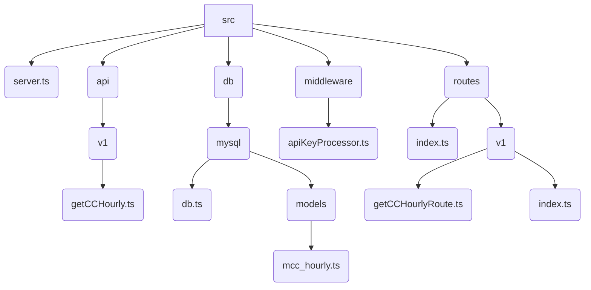
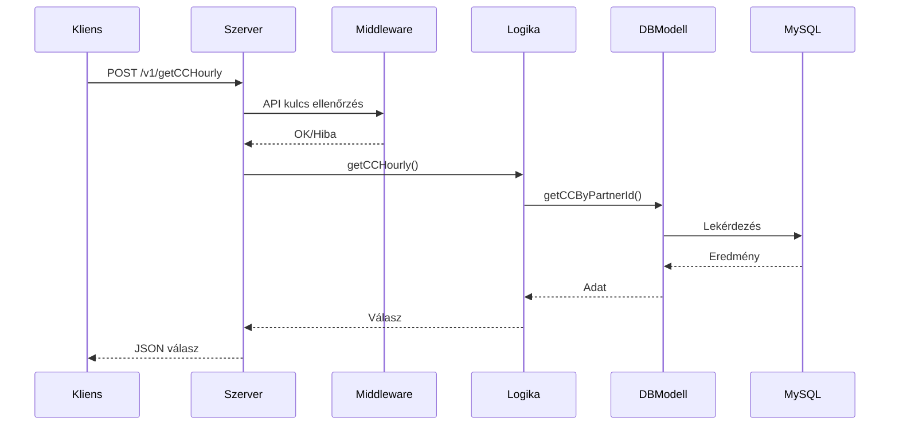
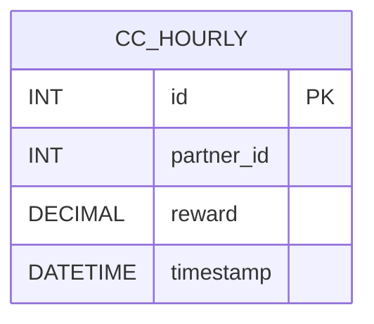

# DBRCoin API Szerver

## Áttekintés

A DBRCoin API Szerver egy Fastify-alapú Node.js REST API, amely óránkénti kriptovaluta jutalom adatokat szolgáltat MySQL adatbázisból. TypeScript-ben íródott, környezeti változókat használ, és API kulcs alapú biztonságot alkalmaz.

## Használt technológiák

- Node.js
- Fastify
- TypeScript
- MySQL (mysql2)
- dotenv

## Mappa- és fájlstruktúra

```plaintext
.env
package.json
tsconfig.json
startDBRCoin5100Api
startDBRCoin5100ApiDev
src/
  server.ts
  api/
    v1/
      getCCHourly.ts
  db/
    mysql/
      db.ts
      models/
        mcc_hourly.ts
  middleware/
    apiKeyProcessor.ts
  routes/
    index.ts
    v1/
      getCCHourlyRoute.ts
      index.ts
```

### Mappák leírása

- **src/server.ts**: Fő belépési pont, Fastify szerver és útvonalak beállítása.
- **src/api/v1/getCCHourly.ts**: Üzleti logika a `/v1/getCCHourly` végponthoz.
- **src/db/mysql/db.ts**: MySQL kapcsolat és lekérdezési segédfüggvények.
- **src/db/mysql/models/mcc_hourly.ts**: Adatelérés a `cc_hourly` táblához.
- **src/middleware/apiKeyProcessor.ts**: API kulcs ellenőrző middleware.
- **src/routes/**: Útvonalak regisztrációja és szervezése.

## API Dokumentáció

### `/v1/getCCHourly` (POST)

- **Fejléc:** `x-api-key: <API_KULCS>`
- **Kérés törzse:**  
  ```json
  { "partnerId": 123 }
  ```
- **Válasz:**  
  ```json
  {
    "success": true,
    "statusCode": 200,
    "data": { ... },
    "infoList": [],
    "errors": []
  }
  ```

#### Példa kérés

```bash
curl -X POST http://localhost:5100/v1/getCCHourly \
  -H "x-api-key: sajat_api_kulcs" \
  -H "Content-Type: application/json" \
  -d '{"partnerId": 123}'
```

## Adatbázis séma

A `cc_hourly` tábla óránkénti jutalom adatokat tárol partnerekhez.

| Oszlop      | Típus    | Leírás                    |
|-------------|----------|---------------------------|
| id          | INT      | Elsődleges kulcs           |
| partner_id  | INT      | Partner azonosító          |
| reward      | DECIMAL  | Jutalom összege            |
| timestamp   | DATETIME | Óránkénti időbélyeg        |

## Biztonság

- Minden végpont érvényes API kulcsot igényel a `x-api-key` fejlécben.
- Az adatbázis elérési adatok és API kulcs a `.env` fájlban található.

## Konfiguráció

A következőket állítsd be a `.env` fájlban:

```
DB_HOST=...
DB_USER=...
DB_PASSWORD=...
DB_DATABASE=...
API_KEY=...
```

## Szerver indítása

```bash
npm install
npm run build
./startDBRCoin5100ApiDev   # Fejlesztés
./startDBRCoin5100Api      # Éles
```

## API bővítése

- Új végpontokat a `src/api/v1/` mappában hozz létre, és regisztráld a `src/routes/v1/`-ben.
- Új API verzióhoz hozz létre új mappát (pl. `src/api/v2/`).

## Mermaid diagramok

### Mappastruktúra



### API kérés folyamata



### Adatbázis séma



---

# Licenc

MIT