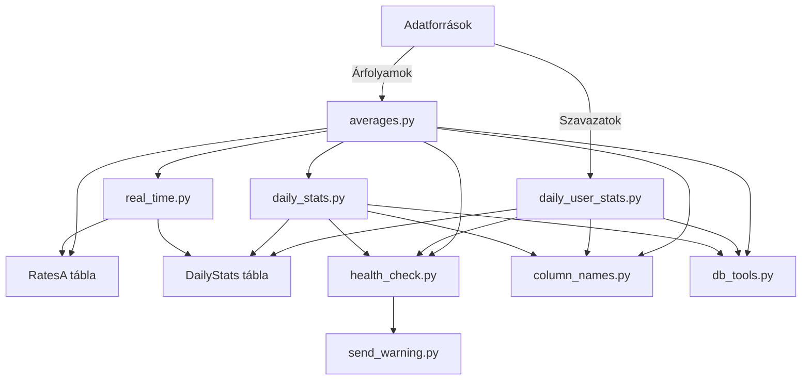
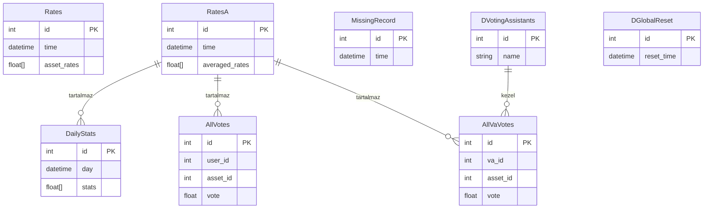
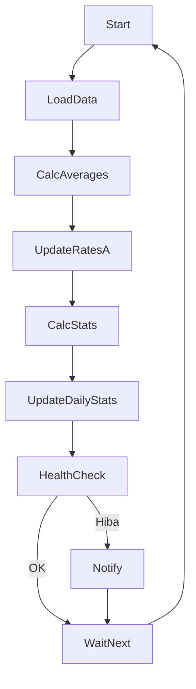

# DBR Projekt Dokumentáció

## 1. Projekt Áttekintés

A DBR projekt egy adat-analitikai és feldolgozó rendszer, amely pénzügyi eszközárfolyamok és felhasználói szavazatok aggregálására, elemzésére és riportolására szolgál. Fő célja gördülő átlagok, napi statisztikák és optimális értékek számítása a követett eszközökre (pl. olaj, EUR, arany, BTC), miközben kezeli a felhasználói inputokat és biztosítja az adatintegritást.

A rendszer nyers árfolyamokat és szavazatokat fogad, ezeket több lépésben feldolgozza, majd eredményeit relációs adatbázisban tárolja. `Fő fogalmak: eszközök, árfolyamok, DBR (Dinamikus Bázisráta), felhasználói szavazás.` Az adatok beolvasástól az átlagoláson és statisztikákon át a riportolásig és értesítésig áramlanak.

## 2. Architektúra Diagram

## 3. Adatbázis séma diagram

## 4. Adatfolyam leírás

1. Új árfolyam és szavazat adatok érkeznek külső forrásból és bekerülnek az adatbázisba.
2. Az `averages.py` gördülő átlagokat számol a legutóbbi mintákból, eredményt a `RatesA` táblába menti.
3. A `daily_stats.py` napi statisztikákat számol minden eszközre (pl. alkalmazott és optimális DBR), eredményt a `DailyStats` táblába menti.
4. A `daily_user_stats.py` felhasználói szintű statisztikákat számol szavazatok és eszközteljesítmény alapján.
5. A `real_time.py` kezeli a valós idejű frissítéseket, biztosítja a `RatesA` naprakészségét, szükség esetén resetel.
6. Health check és hibakezelő modulok figyelik a hiányzó vagy hibás adatokat, naplóznak és szükség esetén Discordon értesítenek.

## 5. Fő osztályok és függvények

- **AveragePrecalculator**: Gördülő átlagok számítása és feltöltése az adatbázisba. Batch feldolgozást és a `RatesA` táblát használja.
- **BaseAssetCalculator**: Napi statisztikák számítása minden eszközre (pl. hozam, DBR értékek) a `RatesA` alapján.
- **OptimalCalculator**: Optimális DBR értékek meghatározása történeti adatok alapján.
- **DailyUserStatCalculator**: Felhasználói szavazatok aggregálása, elemzése, riport statisztikák készítése.
- **RTC (real-time controller)**: Valós idejű frissítések szervezése, adatnaprakészség és resetek kezelése.

## 6. Fő algoritmusok és számítások

- **Gördülő átlag számítás**: Idősoros adatokon csúszó ablakos átlagolás minden eszközre, a rövid távú kilengések kisimítására.
- **DBR számítás**: Dinamikus bázisráta számítása, értékek skálázása és normalizálása az összehasonlíthatóság érdekében.
- **Napi hozam és legjobb szavazat statisztikák**: Napi teljesítménymutatók aggregálása eszközökre és felhasználókra.
- **Hiányzó/késő adatok kezelése**: Forward-filling és health check a teljesség és integritás érdekében.

## 7. Hibakezelés és health check

- Hiányzó vagy duplikált sorok detektálása egyedi kivételekkel és validációval.
- Adathibák naplózása és kritikus esetben Discord értesítés (`send_warning.py`).
- Hiányos adatok pótlása forward-fillinggel vagy újraszámolással.

## 8. Valós idejű feldolgozási folyamat

## 9. Konfiguráció és konstansok

- **ASSET_NO**: Követett eszközök száma (pl. 4: olaj, EUR, arany, BTC).
- **SAMPLES**: Minták száma az átlagoláshoz a DBR számításban.
- **MyNAN**: Speciális érték hiányzó vagy hibás adat jelölésére az adatbázisban.
- **DBR_SCALE_VALUE**: Skálázó tényező a DBR értékek egységesítéséhez.

## 10. Naplózás és értesítések

A naplózás a Python `logging` moduljával történik, rotáló fájlkezelővel. Kritikus hibák Discordon keresztül jutnak el a projekt felelőseihez a `send_warning.py` modul segítségével, amely HTTP POST kérést küld egy webhookra.

## 11. Bővítés és karbantartás

- Új eszköz hozzáadásához frissítsd az `ASSET_NO`-t, és minden érintett táblát, számítást igazíts hozzá.
- Átlagolási logika módosításához az `AveragePrecalculator`-t és kapcsolódó függvényeket kell módosítani.
- Új értesítési csatorna integrálásához bővítsd a `send_warning.py`-t további végpontokkal.
- Kódminőség fenntartása: moduláris felépítés, alapos hibakezelés, rendszeres health check.
- Adatintegritás: bemenetek és kimenetek validálása minden feldolgozási lépésnél.