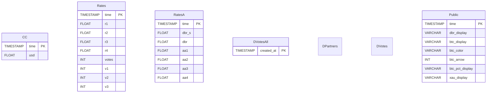

# dbrpp_db Projekt Dokumentáció

## Áttekintés

A **dbrpp_db** projekt egy adatfeldolgozó és adatbázis-kezelő rendszer, amely egy mobilalkalmazást támogat. Nyilvános és privát adatokat olvas be, dolgoz fel és tárol, naprakész statisztikákat és elemzéseket biztosítva. A rendszer több Python modulból áll `(adatbetöltés, számítás, adatbázis-kezelés, naplózás)`, amelyeket a `dbrpp_calc` szkript vezérel, különböző futási módokkal `(debug, run, schedule)`.

## Telepítés

1. Klónozd a repót és lépj be a projekt könyvtárba.
2. Függőségek telepítése:
   ```
   pip install -r requirements.txt
   ```
3. Környezeti változók beállítása a `.env` fájlban.
4. További információ: `README.md`.

## Könyvtárstruktúra

- `calculations.py`: Fő adatfeldolgozó és számítási logika.
- `conf_log.py`: Naplózás beállítása.
- `config.py`: Adatbázis és alkalmazás konfiguráció.
- `db.py`: Adatbázis kapcsolat és segédfüggvények.
- `dbrpp_calc`: Fő futtatható szkript.
- `loader.py`: Adatbetöltő és író függvények.
- `models.py`: SQLAlchemy ORM modellek.
- `Private.parquet`: Privát adatfájl.
- `processes.json`: Folyamatok nyilvántartása.
- `restart.sh`: Újraindító szkript.
- `logs/`: Naplófájlok könyvtára.
- `pl/`: Pluginek vagy további szkriptek.
- `results.md`: Kimeneti dokumentáció.

## Fő szkript futtatása

A fő szkript a `dbrpp_calc`. Főbb módjai:
- **schedule**: Ütemezett háttérfutás, percenként.
- **debug**: Hibakeresési mód, tesztadatbázissal.
- **run**: Egyszeri futtatás.

```
./dbrpp_calc --help
nohup ./dbrpp_calc -m schedule > logs/stdout.log 2>&1 &
./restart.sh
```

## Naplózás és konfiguráció

- **Naplózás**: `conf_log.py` állítja be, naplók a `logs/` könyvtárban.
- **Konfiguráció**: `config.py` és `.env` kezeli.

## Adatbázis és adatmodell

### SQLAlchemy modellek (`models.py`)

- `CC`: Árfolyam adatok (usd, time).
- `Rates`: Árfolyamok (r1, r2, r3, r4, time, votes, v1, v2, v3).
- `RatesA`: Alternatív árfolyamok (dbr_s, dbr, aa1, aa2, aa3, aa4, time).
- `DVotesAll`: Minden szavazat (created_at, ...).
- `DPartners`: Partner adatok.
- `DVotes`: Egyedi szavazatok.
- `Public`: Aggregált nyilvános adatok (time, dbr_display, btc_display, btc_color, btc_arrow, btc_pct_display, xau_display, ...).

Minden modell egy adatbázis táblához tartozik, mezőkkel, típusokkal és megszorításokkal a `models.py` szerint.

### Private.parquet

A `Private.parquet` egy Parquet formátumú privát adatfájl, amelyet a `loader.py` dolgoz fel és tölt be az adatbázisba.

## Adatfeldolgozás és számítás

- **Fő folyamat**: `calculations.py` és `dbrpp_calc` vezérli.
- `count_public_data` és `count_private_data`: aggregálás, feldolgozás, formázás.
- `loader.py`: `Private.parquet` olvasása, adatbázisba írás.
- `db.py`: Adatbázis kapcsolat és `ConnectionHandler` osztály.

## Tesztelés és validáció

- `format_test.py`: Egységtesztek.
- Futtatás:
  ```
  python format_test.py
  ```

## Konfiguráció és naplózás

- `config.py`: Adatbázis URL-ek, jogosultságok, beállítások.
- `conf_log.py`: Naplózás formátuma, szintje, kimenet.

## Folyamat és munkafolyamat

- `processes.json`: Folyamatok nyilvántartása.
- `restart.sh`: Újraindító szkript.
- Ütemezés: `schedule` a `dbrpp_calc`-ban, háttérben `nohup`-pal.

## Eredmények és kimenetek

- Kimeneti fájlok és naplók a `logs/` könyvtárban.
- `results.md`: Kimeneti formátumok és eredmények dokumentációja.

## Mermaid diagramok

### Magas szintű architektúra


### Adatbázis séma (ER diagram)



### Adatfolyam: Bemenet az adatbázisig


### Fő adatfeldolgozási folyamat


### Szkript futtatási sorrend


### Ütemezés és újraindítás folyamata

