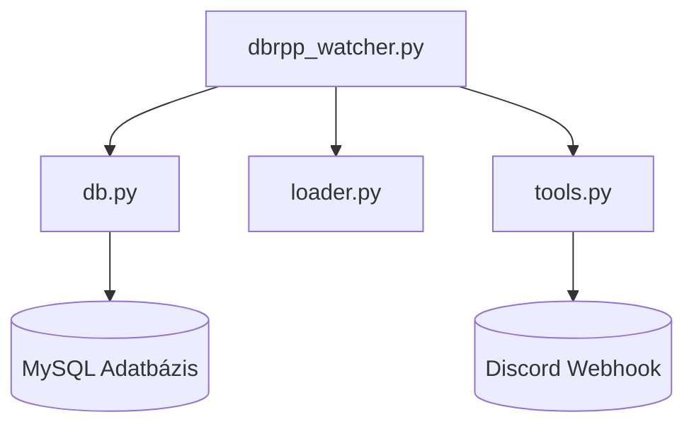
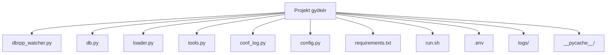
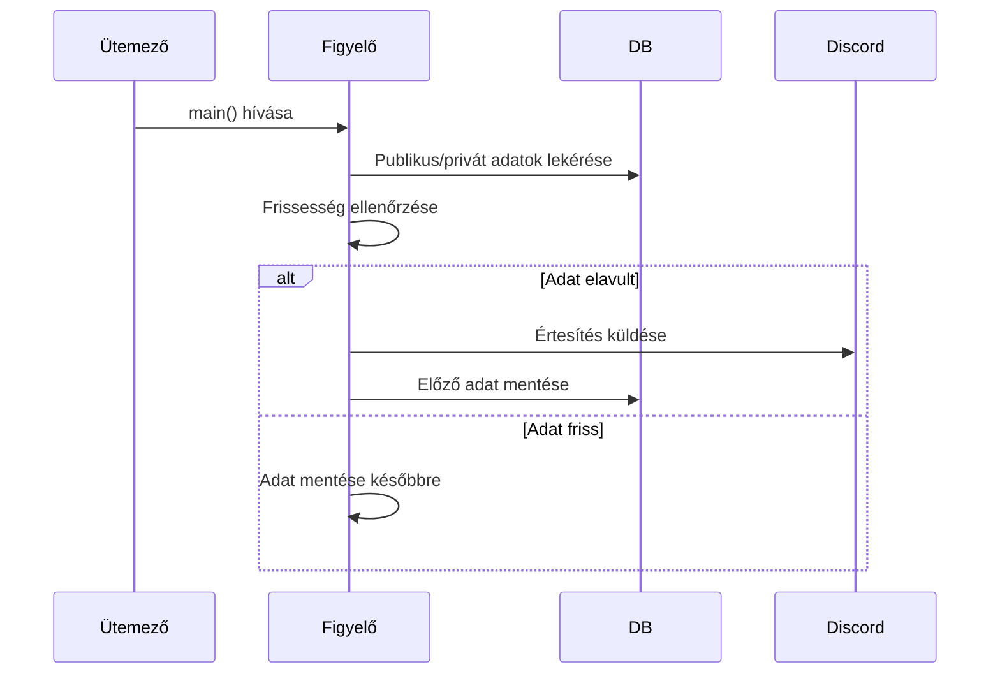

# dbrpp_watcher Projekt Dokumentáció

## 1. Projekt bemutatása

**Cél:** A `dbrpp_watcher` egy Python-alapú monitorozó eszköz, amely rendszeresen ellenőrzi egy MySQL adatbázis (különösen a "dbrpp" adatbázis) adatainak frissességét.

**Megoldott probléma:** Automatizáltan észleli az adatkimaradást vagy elavulást, Discordon értesíti az illetékeseket, és biztosítja a publikus és privát adatok naprakészségét.  

**Célközönség:** Adatbázis-adminisztrátorok, adatmérnökök, üzemeltetők.  

**Fő funkciók:**
- Ütemezett ellenőrzések publikus és privát adatokra
- Automatikus Discord értesítés problémák esetén
- Kíméletes leállítás és folyamatkezelés
- Egyedi naplózás, naplóforgatással
- Környezeti változókkal konfigurálható

## 2. Architektúra áttekintés

A projekt egy fő watcher szkript köré épül, amely szervezi az adatbázis-ellenőrzést, naplózást, értesítéseket és ütemezést. Segédmodulokat használ az adatbázis eléréshez, naplózáshoz, konfigurációhoz és egyéb segédfüggvényekhez.

- `dbrpp_watcher.py`: Fő belépési pont, ütemezés, szervezés
- `db.py`: Adatbázis kapcsolatkezelés
- `loader.py`: Adatbetöltés és írás logika
- `tools.py`: Segédfüggvények (értesítés, PID, szignálkezelés)
- Külső szolgáltatások: MySQL adatbázis, Discord webhook

**Architektúra diagram:**



## 3. Fájl- és könyvtárstruktúra

- `dbrpp_watcher.py`: Fő watcher szkript
- `db.py`: Adatbázis kapcsolatkezelő
- `loader.py`: Adatbetöltő/író függvények
- `tools.py`: Segédfüggvények (értesítés, PID, szignálok)
- `conf_log.py`: Naplózás konfiguráció
- `config.py`: `.env` betöltése
- `requirements.txt`: Python függőségek
- `run.sh`: Indító shell script
- `.env`: Környezeti változók
- `logs/`: Naplófájlok (forgatott)
- `__pycache__/`: Python bytecode cache

**Könyvtárstruktúra diagram:**



## 4. Konfiguráció

- `.env` fájl: DB hozzáférés, webhook URL, base URL
- `config.py`: Betölti és elérhetővé teszi ezeket

**Szükséges opciók:** MySQL kapcsolati adatok és `DC_WEBHOOK_URL`.  
**Beállítás:** Másold a `.env`-t a projekt gyökérbe, töltsd ki az adatokat.

```env
MYSQL_PORT            =   3306
MYSQL_HOST_DBR        =   "localhost"
MYSQL_USER_DBR        =   "user"
MYSQL_PASSWORD_DBR    =   "password"
MYSQL_DATABASE_DBR    =   "DBR"
...
DC_WEBHOOK_URL        =   "https://discord.com/api/webhooks/..."
```

## 5. Naplózás

- A naplózást a `conf_log.py` és `init_log()` inicializálja
- A naplók a `logs/` könyvtárba kerülnek
- A naplózási szint és formátum módosítható a `dbrpp_watcher.py` és `conf_log.py` fájlokban

## 6. Adatbázis integráció

- Az adatbázis kapcsolatot a `ConnectionHandler` kezeli (`db.py`)
- MySQL-hez kapcsolódik a `.env` alapján
- A `dbrpp` adatbázis tábláival dolgozik (publikus és privát adatok)

## 7. Ütemezés és fő ciklus

- A `schedule` könyvtár futtatja a `main()`-t percenként adott másodperckor
- Minden futás lekéri a publikus/privát adatokat, ellenőrzi a frissességet, szükség esetén értesít

**Ütemezett futás szekvencia diagram:**



## 8. Szignálkezelés és folyamatmenedzsment

- Kezeli a `SIGINT` és `SIGTERM` jeleket a `custom_signal_handler` segítségével (`tools.py`)
- Saját PID-jét JSON fájlban tárolja
- Kíméletes leállításkor naplóz és takarít

## 9. Értesítések

- Discord értesítések a `send_message_to_dc` függvénnyel (`tools.py`)
- Adat elavulás vagy hiba esetén aktiválódik
- A webhook URL a `.env`-ben `DC_WEBHOOK_URL` néven

## 10. Adatbetöltés és írás

- `send_private_data_bin`: Privát adat bináris fájlként küldése
- `send_public_data`: Publikus adat küldése
- `db_writer_pub`: Publikus adat írása adatbázisba
- `db_writer_priv_df`: Privát adat írása adatbázisba

## 11. Hibakezelés

- Hibák a `logs/*.err` fájlokba kerülnek
- Kritikus hibák Discord értesítést is kiválthatnak
- A naplók visszanézhetők hibakereséshez

## 12. Telepítés és futtatás

- Függőségek telepítése: `pip install -r requirements.txt`
- `.env` beállítása
- Indítás: `./run.sh` vagy `python dbrpp_watcher.py`
- Naplók figyelése a `logs/` könyvtárban

## 13. Bővítés és testreszabás

- Új adatellenőrzés: `main()` bővítése vagy új függvény a `loader.py`-ban
- Új értesítési csatorna: új függvény a `tools.py`-ban
- Új konfigurációs opció: `.env` és `config.py` bővítése

## 14. Tesztelés

- Alapértelmezetten nincs explicit teszt
- Adj hozzá teszteket pl. `pytest`-tel
- Futtatás: `pytest` vagy hasonló eszköz

## 15. Fogalomtár

- **dbrpp**: A monitorozott MySQL adatbázis
- **Figyelő**: A fő folyamat, amely ellenőrzi az adatok frissességét
- **Publikus/Privát adat**: A watcher által kezelt különböző adathalmazok
- **Discord Webhook**: URL végpont Discord értesítésekhez
- **PID**: Folyamat azonosító, a futó példányok követéséhez
- **Schedule**: Python könyvtár időzített feladatokhoz