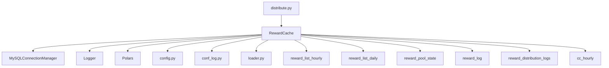
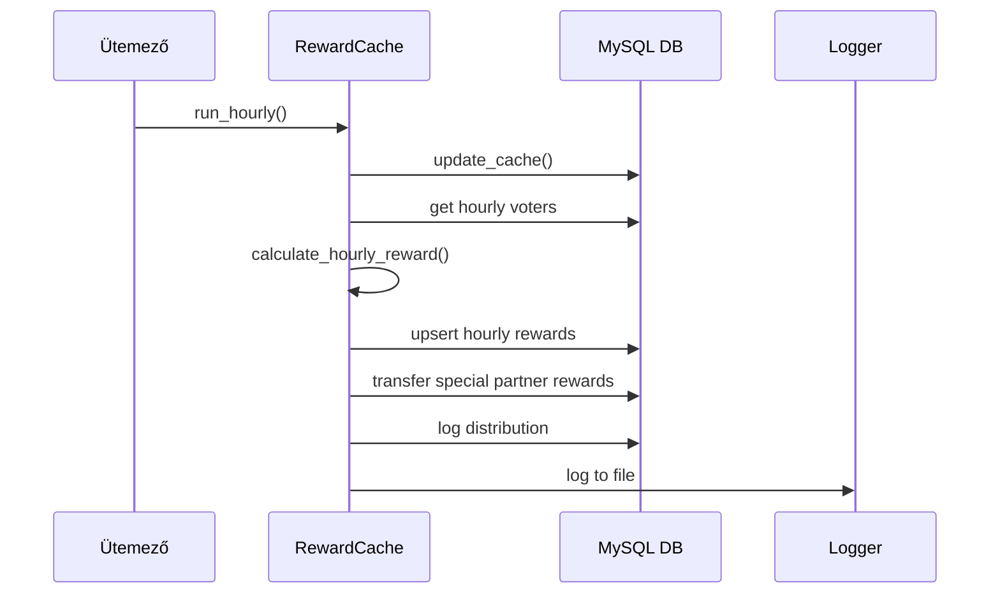
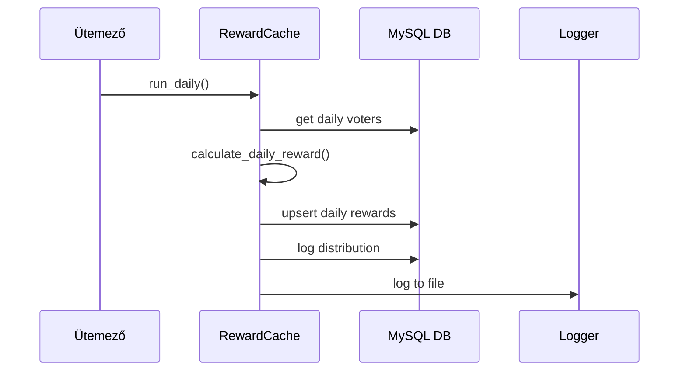
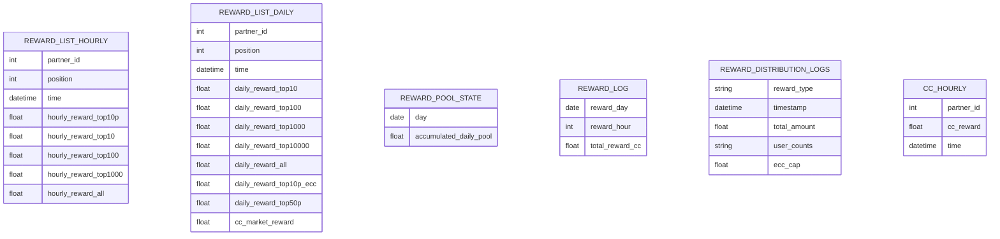
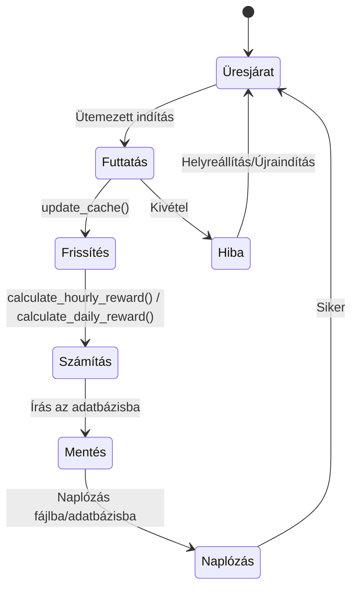

# Jutalomelosztó Rendszer

## Projekt célja és áttekintése

A Jutalomelosztó Rendszer automatizálja a partnerek szavazási aktivitása alapján járó jutalmak kiszámítását és kiosztását. Fő felhasználói a partnerprogram üzemeltetői és maguk a partnerek. A rendszer célja a részvételen alapuló, igazságos, átlátható és auditálható jutalomelosztás biztosítása, rögzített és dinamikus szabályok keverékével.

**Cél:**
- Óránkénti és napi jutalomszámítás automatizálása
- Szavazók részvételének és jogosultságának nyomon követése
- Eredmények mentése MySQL adatbázisba audit és riport céljából
- Speciális partnerek kezelése egyedi jutalmazási logikával
- Naplózás, monitorozás és biztonságos újraindítás támogatása

## Architektúra

### Fő komponensek

- **distribute.py**: Fő logika, ütemező, és a `RewardCache` osztály
- **db.py**: MySQL kapcsolatkezelő
- **config.py**: Adatbázis és rendszer konfiguráció
- **conf_log.py**: Naplózás beállítása
- **loader.py**: Adatbetöltő segédletek

### Komponensek kapcsolata

- A `RewardCache` szervezi a jutalomszámítást, adatbázis műveleteket és naplózást
- Az **db.py**-ban lévő `MySQLConnectionManager`-t használja minden DB eléréshez
- A konfiguráció és naplózás a megfelelő modulokból töltődik be

### Adatfolyam

1. A szavazási adatok az adatbázisból kerülnek beolvasásra
2. A jutalom alapokat frissítik a legutóbbi szavazások és CC árfolyam alapján
3. Az óránkénti és napi jutalmak kiosztása többszintű logika szerint történik
4. Az eredmények MySQL táblákba kerülnek mentésre audit és további feldolgozás céljából
5. Speciális partnerek további jutalmat kapnak
6. Minden főbb művelet naplózásra kerül

## Adatbázis

### Fő táblák és sémák

| Tábla                      | Leírás                              | Kulcs mezők                                                                                      |
|----------------------------|-------------------------------------|--------------------------------------------------------------------------------------------------|
| `reward_list_hourly`       | Óránkénti jutalmak tárolása         | partner_id, position, time, hourly_reward_top10p, hourly_reward_top10, hourly_reward_top100, hourly_reward_top1000, hourly_reward_all |
| `reward_list_daily`        | Napi jutalmak tárolása              | partner_id, position, time, daily_reward_top10, daily_reward_top100, daily_reward_top1000, daily_reward_top10000, daily_reward_all, daily_reward_top10p_ecc, daily_reward_top50p, cc_market_reward |
| `reward_pool_state`        | Felhalmozott napi jutalmak követése | day, accumulated_daily_pool                                                                      |
| `reward_log`               | Minden elosztás audit naplója       | reward_day, reward_hour, total_reward_cc, ... (különböző számok és összegek)                     |
| `reward_distribution_logs` | Minden elosztás JSON naplója        | reward_type, timestamp, total_amount, user_counts, ecc_cap                                       |
| `cc_hourly`                | Speciális partnerek jutalmai        | partner_id, cc_reward, time                                                                      |

### Adatbázis elérés

- **Olvasás:** Szavazási adatok, CC árfolyamok és előző állapotok SQL lekérdezéssel
- **Írás:** Jutalmak, naplók és állapotok upsert és insert műveletekkel
- **Speciális partnerek:** Óránkénti jutalmak összegezve, távoli adatbázisba továbbítva

## Jutalmazási logika

### Óránkénti jutalmak

- **Az alap 5 egyenlő kategóriára oszlik:** legjobb 10%, legjobb 10, legjobb 100, legjobb 1000, mindenki
- A jutalmak kiosztása a partner helyezése alapján történik
- **Jogosultság:** Csak az utolsó órában szavazók vehetnek részt

### Napi jutalmak

- Az ECC limit a legjobb 10% partnerek átlagos ECC-jének 5-szöröse
- **Az alap felosztása:**
    - Fix helyezésű jutalmak (felső kategóriák, minimum szavazatszám szükséges)
    - ECC-alapú jutalmak (korlátozott ECC súlyozással)
    - Legjobb 50% részvételi jutalom
    - CC piaci árfolyam bónusz
- **Jogosultság:** Minimum szavazatszám és részvételi küszöb

### Speciális partnerek

- A `SPECIFIC_PARTNERS` listában lévő partnerek óránkénti jutalma összegezve, távoli adatbázisba kerül

## Ütemezés és automatizálás

- A `schedule` könyvtárat használja időzített futtatáshoz
- Óránkénti jutalmak: minden óra :30-kor
- Napi jutalmak: minden nap 00:00:35-kor
- Teszt mód: `TEST = True` a `distribute.py`-ban egyetlen ciklushoz
- Kíméletes leállítás és folyamatkövetés a `processes.json` és szignálkezelők segítségével
- Hibák: tranzakciók visszagörgetése, hibák naplózása, állapot mentése újraindításhoz

## Konfiguráció és környezet

- **config.py**: Adatbázis kapcsolatok és rendszerparaméterek
- **conf_log.py**: Naplózás konfiguráció
- **.env**: (Opcionális) érzékeny adatok környezeti változókban
- Az adatbázis elérési adatait és tábla neveket a `config.py`-ban kell beállítani

## Naplózás és monitorozás

- Minden főbb művelet és hiba naplózása fájlba (lásd `logs/` könyvtár)
- Jutalomelosztások naplózása a `reward_distribution_logs` táblába is
- Partnerenkénti szavazatszámok részletes naplózása DEBUG szinten
- Kíméletes leállítás és napló flush szignálkezelőkkel

## Bővítés és testreszabás

- Új jutalom kategóriák vagy logika módosításához a `calculate_hourly_reward` és `calculate_daily_reward` függvényeket kell módosítani a `RewardCache`-ben
- Új partner típusok vagy szavazási szabályok támogatásához SQL lekérdezések és jutalomkiosztás módosítása szükséges
- Új naplózás vagy monitorozás hozzáadásához bővítsd a `log_distribution`-t vagy adj hozzá új naplóhívásokat

## Üzemeltetés

- **Követelmények:** Python 3.8+, MySQL, függőségek a `requirements.txt`-ben
- **Telepítés:** `python distribute.py` futtatása ütemezett szolgáltatásként
- **Leállítás/Újraindítás:** Folyamatkövetés a `processes.json`-ban, szignálkezelők a biztonságos leállításhoz
- **Frissítés:** Állítsd le a szolgáltatást, frissítsd a kódot/függőségeket, indítsd újra

## Tesztelés

- Egységtesztek a `test_calc.py`-ban
- Teszt mód: `TEST = True` a `distribute.py`-ban
- Teszt adatbázisok és mock adatok használata biztonságos teszteléshez
- Teljesítménytesztek nagy adathalmazokkal

## Mermaid diagramok

### Komponens diagram

### Szekvencia diagram: Óránkénti jutalomelosztás

### Szekvencia diagram: Napi jutalomelosztás

### Entitás-kapcsolat diagram (ERD)

### Állapotdiagram: Jutalom alapok

### Folyamatábra: update_cache, calculate_hourly_reward, calculate_daily_reward

```mermaid
flowchart TD
    subgraph update_cache
        A1[Kezdés] --> B1[Utolsó óra CC szavazatok lekérése]
        B1 --> C1[Szavazók számának lekérése]
        C1 --> D1[Aktuális CC árfolyam lekérése]
        D1 --> E1[Elosztás: 25% óránkénti, 75% napi]
        E1 --> F1[Napi alap mentése]
        F1 --> G1[Vége]
    end
    subgraph calculate_hourly_reward
        A2[Kezdés] --> B2[Óránkénti szavazók lekérése]
        B2 --> C2{Vannak szavazók?}
        C2 -- Nem --> D2[Üres naplózása]
        C2 -- Igen --> E2[Alap felosztása 5 kategóriára]
        E2 --> F2[Jutalmak kiosztása helyezés szerint]
        F2 --> G2[Upsert az adatbázisba]
        G2 --> H2[Speciális partnerek átutalása]
        H2 --> I2[Elosztás naplózása]
        I2 --> J2[Vége]
    end
    subgraph calculate_daily_reward
        A3[Kezdés] --> B3[Napi szavazók lekérése]
        B3 --> C3{Vannak szavazók?}
        C3 -- Nem --> D3[Üres naplózása]
        C3 -- Igen --> E3[ECC limit számítása]
        E3 --> F3[Alap felosztása 3 kategóriára]
        F3 --> G3[Szavazási feltételek alkalmazása]
        G3 --> H3[Fix helyezésű jutalmak számítása]
        H3 --> I3[ECC-alapú jutalmak számítása]
        I3 --> J3[Legjobb 50% jutalom számítása]
        J3 --> K3[Piaci bónusz hozzáadása]
        K3 --> L3[Upsert az adatbázisba]
        L3 --> M3[Elosztás naplózása]
        M3 --> N3[Vége]
    end
```

