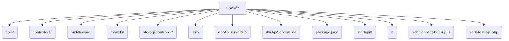
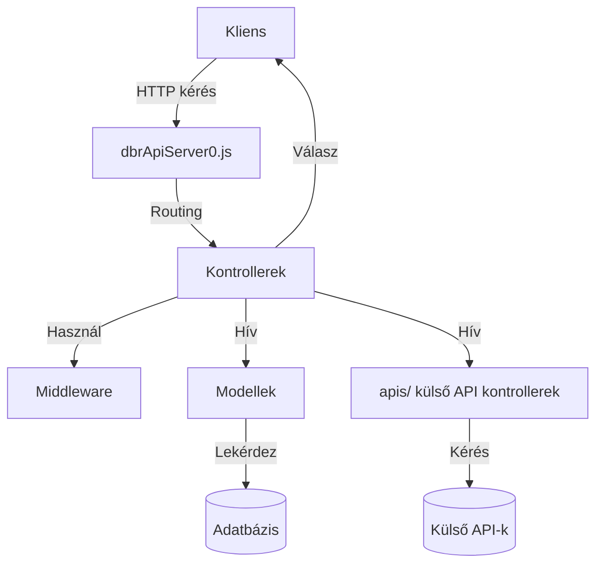
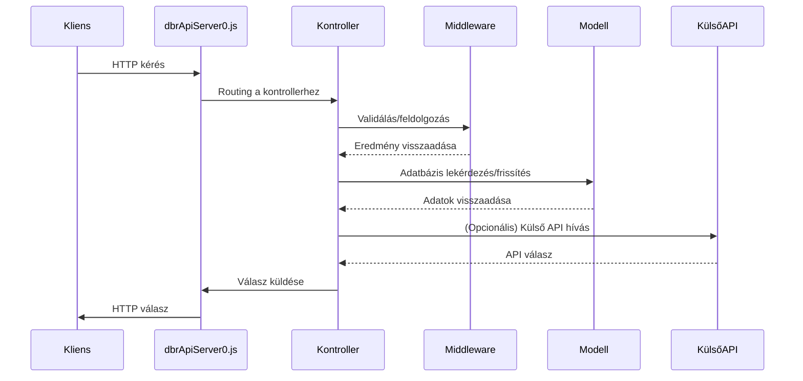
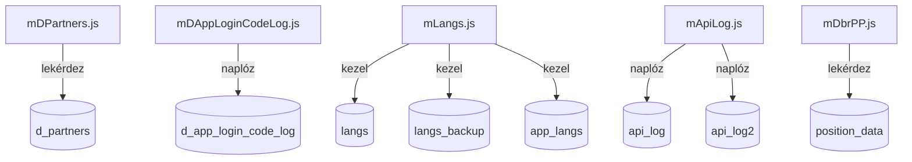
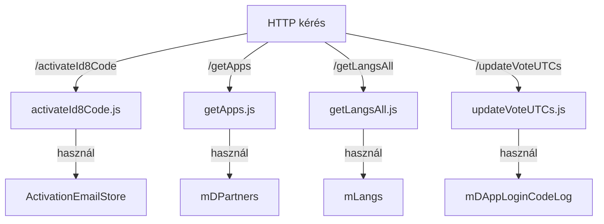
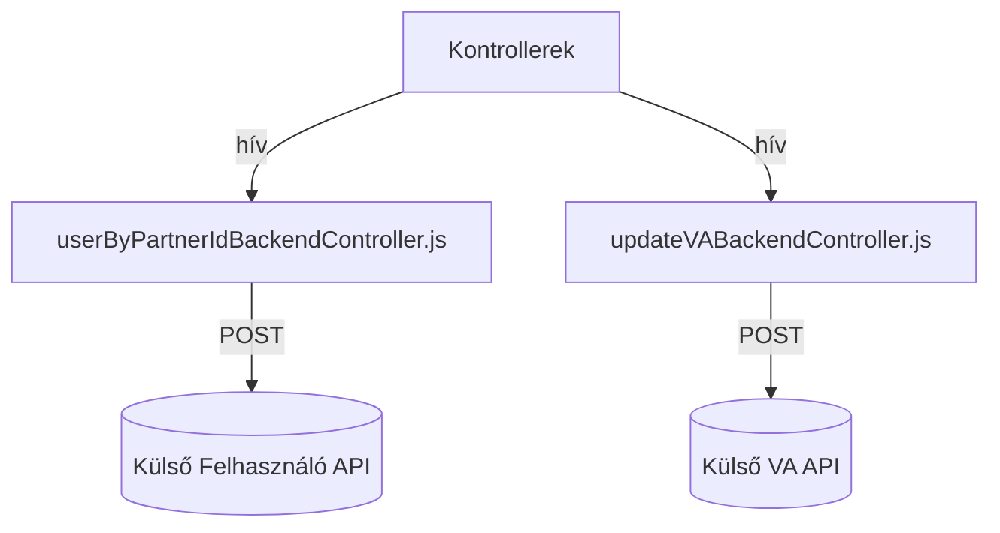

# dbrapi0.smarti.me – Backend API szerver

## Áttekintés

A **dbrapi0.smarti.me** egy Node.js alapú backend API szerver, amely aktivációs kódok, felhasználókezelés, szavazás, nyelvi lokalizáció és külső szolgáltatások integrációját kezeli. A projekt moduláris, jól karbantartható és skálázható felépítésű, világosan elkülönítve a routingot, üzleti logikát, adatbázis-hozzáférést és segédfunkciókat.

---

## Tartalomjegyzék

- [Projektstruktúra](#projektstruktúra)
- [Mappák és fájlok leírása](#mappák-és-fájlok-leírása)
- [API végpontok](#api-végpontok)
- [Adatbázis modellek](#adatbázis-modellek)
- [Konfiguráció](#konfiguráció)
- [Indítás és telepítés](#indítás-és-telepítés)
- [Példa adatfolyam](#példa-adatfolyam)
- [Segéd- és régi szkriptek](#segéd--és-régi-szkriptek)
- [Architektúra diagramok (Mermaid)](#architektúra-diagramok-mermaid)
- [Hozzájárulás](#hozzájárulás)
- [Licenc](#licenc)

---

## Projektstruktúra

```
.
├── apis/
├── controllers/
├── middleware/
├── models/
├── storagecontroller/
├── .env
├── dbrApiServer0.js
├── dbrApiServer0.log
├── package.json
├── startapi0
├── z
├── zdbConnect-backup.js
├── zdrb-test-api.php
```

---

## Mappák és fájlok leírása

### Gyökérkönyvtár

- **.env**  
  Környezeti változók adatbázis kapcsolathoz, API kulcsokhoz és konfigurációhoz.

- **dbrApiServer0.js**  
  Fő belépési pont. HTTP szerver indítása, kérések feldolgozása, továbbítása a kontrollerekhez.

- **dbrApiServer0.log**  
  Naplófájl a szerver kimenetéhez és hibákhoz.

- **package.json**  
  Node.js projekt leíró (függőségek, szkriptek, metaadatok).

- **startapi0**  
  Shell szkript a szerver indításához `nodemon`-nal, naplózás átirányítása.

- **z**  
  Shell szkript a naplófájl tömörítéséhez.

- **zdbConnect-backup.js**  
  Segédprogram adatbázis kapcsolathoz és lekérdezésekhez (mentés vagy tesztelés).

- **zdrb-test-api.php**  
  Régi PHP szkript teszteléshez vagy integrációhoz.

---

### apis/

Backend kontrollerek külső API-k vagy háttérrendszerek eléréséhez.

- **updateVABackendController.js**  
  HTTPS POST kérések küldése a Voting Assistant (VA) státusz frissítéséhez.

- **userByPartnerIdBackendController.js**  
  Felhasználóval kapcsolatos háttér API hívások partner ID alapján.

- **webAppBackendController.js**  
  Szavazási kérések küldése a webalkalmazás backendjének.

- **webAppPositionBackendController.js**  
  Pozícióval kapcsolatos háttér API hívások.

- **webAppVABackendController.js**  
  VA-hoz kapcsolódó kérések küldése a webalkalmazás backendjének.

---

### controllers/

Végpontokat kezelő kontrollerek.

- **activateId8Code.js**  
  ID8 kódok aktiválása.

- **activateId8CodeDetails5b9e3c2.js**  
  Aktiválás további részletekkel.

- **activateId8CodePartnerIdDetails.js**  
  Aktiválás partner ID-vel és részletekkel.

- **activateId8CodeWithDetails.js**  
  Aktiválás részletesebb információkkal.

- **getAllLast2Rows.js**  
  Az utolsó két sor lekérdezése egy adatforrásból.

- **getApps.js**  
  Alkalmazások listájának lekérdezése.

- **getLangsAll.js**  
  Minden nyelvi rekord lekérdezése.

- **storeLangs.js**  
  Nyelvi rekordok mentése, frissítése.

- **storeAppLangs.js**  
  Alkalmazás-specifikus nyelvi rekordok mentése, frissítése.

- **getPPRRP.js, getPRRP.js**  
  Pozíció vagy publikus adatok lekérdezése redundanciával/újrapróbálkozással.

- **getVASwitch.js, getVASwitchRRP.js**  
  VA kapcsoló állapotának lekérdezése.

- **updateVASwitch.js, updateVASwitchVPH.js**  
  VA kapcsoló állapotának frissítése.

- **updateVoteUTCs.js**  
  Szavazatok frissítése UTC időbélyeggel.

- **getPublicData.js, getPublicDataRRP.js**  
  Publikus adatok lekérdezése, esetleg redundanciával/újrapróbálkozással.

---

### middleware/

Újrahasznosítható logika kérésfeldolgozáshoz, validációhoz, segédfunkciókhoz.

- **activationEmailStore.js**  
  Email/UDID párok mentése, frissítése, egyedi kódok generálása, naplózás.

- **requestCounter.js**  
  API kérés számláló.

- **requestRetryCounter.js**  
  API újrapróbálkozás számláló.

---

### models/

Adatbázis-hozzáférési logika különböző táblákhoz.

- **dbQuery.js**  
  Alapvető adatbázis lekérdezési funkciók.

- **mDPartners.js**  
  `d_partners` tábla lekérdezése, frissítése (pl. VA státusz).

- **mDAppLoginCodeLog.js**  
  App login kódok, email/UDID párok naplózása.

- **mApiLog.js**  
  API naplózás, több napló táblát támogat.

- **mDbrPP.js**  
  Pozíció és publikus adatok lekérdezése.

- **mLangs.js**  
  Nyelvi rekordok kezelése, mentés, visszaállítás, alkalmazás-specifikus nyelvek.

- **mAppBeApiRequests.js**  
  Backend API kérések percenkénti követése.

- **mDbrAppBeApiProcess.js**  
  Backend API feldolgozási idők követése.

- **mDbrAppBeApiRR.js**  
  Backend API újrapróbálkozások követése.

---

### storagecontroller/

Fájlok tárolása és olvasása.

- **readJson.js**  
  JSON fájlok olvasása a lemezről, publikus adatok kiszolgálásához.

---

## API végpontok

Minden kontroller a `controllers/` mappában egy vagy több végpontot szolgál ki.  
**Példa végpont dokumentáció:**

### `POST /activateId8Code`
- **Leírás:** Egy ID8 kód aktiválása felhasználó számára.
- **Kérés törzse:**  
  - `email` (szöveg): Felhasználó email címe  
  - `udid` (szöveg): Eszköz UDID  
  - `partnerId` (szöveg, opcionális): Partner azonosító  
- **Válasz:**  
  - `status` (szöveg): Siker vagy hiba  
  - `code` (szöveg): Aktivációs kód  
- **Hibák:**  
  - `400`: Hiányzó paraméterek  
  - `500`: Belső szerverhiba

*(Ismételd minden végpontra szükség szerint.)*

---

## Adatbázis modellek

A `models/` mappa modellei kapszulázzák az összes adatbázis-hozzáférést.

- **mDPartners.js:**  
  - Tábla: `d_partners`  
  - Műveletek: VA státusz, partner információk lekérdezése/frissítése.

- **mDAppLoginCodeLog.js:**  
  - Tábla: `d_app_login_code_log`  
  - Műveletek: App login kódok, email/UDID párok naplózása.

- **mLangs.js:**  
  - Táblák: `langs`, `langs_backup`, `app_langs`  
  - Műveletek: Nyelvi rekordok kezelése, mentés/visszaállítás, alkalmazás-specifikus nyelvek.

- **mApiLog.js:**  
  - Táblák: `api_log`, `api_log2`, ...  
  - Műveletek: API kérések és válaszok naplózása.

*(Ismételd minden modellre szükség szerint.)*

---

## Konfiguráció

### `.env` példa

```
DB_HOST=localhost
DB_USER=felhasznalo
DB_PASS=jelszo
DB_NAME=adatbazis
API_KEY=kulcs_ide
LOG_PATH=./dbrApiServer0.log
```

- **DB_HOST, DB_USER, DB_PASS, DB_NAME:**  
  Adatbázis kapcsolat beállításai.

- **API_KEY:**  
  Külső szolgáltatásokhoz szükséges kulcs.

- **LOG_PATH:**  
  A szerver naplófájljának elérési útja.

---

## Indítás és telepítés

1. **Függőségek telepítése:**
   ```sh
   npm install
   ```

2. **Környezet konfigurálása:**
   - Másold a `.env.example`-t `.env`-re, és töltsd ki az értékeket.

3. **Szerver indítása:**
   ```sh
   ./startapi0
   ```

4. **Napló tömörítése:**
   - Használd a `z` szkriptet:
     ```sh
     ./z
     ```

---

## Példa adatfolyam

1. **Kliens** kérést küld a `/activateId8Code` végpontra.
2. **Szerver** (`dbrApiServer0.js`) továbbítja a kérést a `controllers/activateId8Code.js`-nek.
3. **Kontroller** validálja a bemenetet, használja a `middleware/activationEmailStore.js`-t az email/UDID tárolásához, majd hívja a `models/mDAppLoginCodeLog.js`-t a naplózáshoz.
4. **Szükség esetén** a kontroller külső API-t hív az `apis/userByPartnerIdBackendController.js`-en keresztül.
5. **Válasz** visszakerül a klienshez, az esemény naplózásra kerül a `models/mApiLog.js`-ben.

---

## Segéd- és régi szkriptek

- **zdbConnect-backup.js:**  
  Önálló szkript adatbázis kapcsolathoz és lekérdezésekhez, teszteléshez vagy mentéshez.

- **zdrb-test-api.php:**  
  Régi PHP szkript API végpontok vagy adatbázis kapcsolat teszteléséhez.

---

## Architektúra diagramok (Mermaid)

### Projektstruktúra



---

### Magas szintű architektúra



---

### Kérésfolyam



---

### Adatbázis kapcsolatok



---

### API végpont routing



---

### Külső API integráció



---

## Hozzájárulás

1. Forkold a repót.
2. Hozz létre új branch-et a fejlesztéshez vagy hibajavításhoz.
3. Küldj pull requestet a változások leírásával.

---

## Licenc

Ez a projekt MIT licenc alatt érhető el.

---