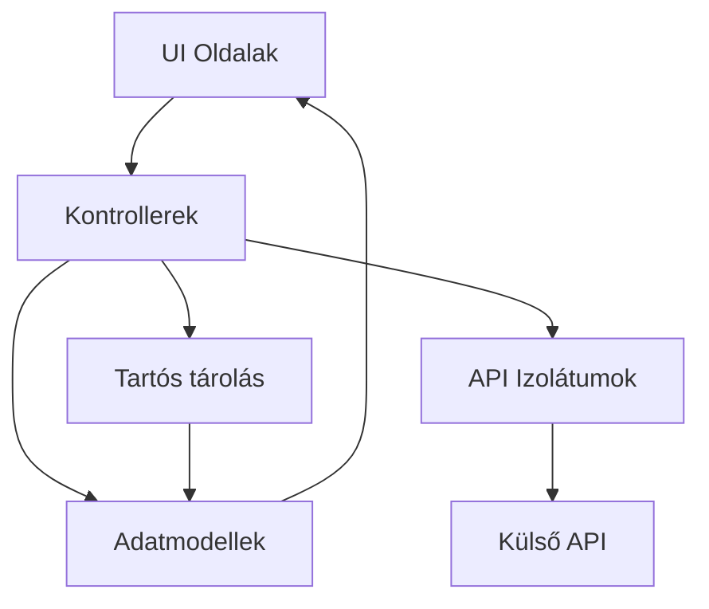
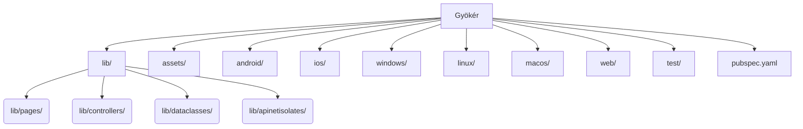
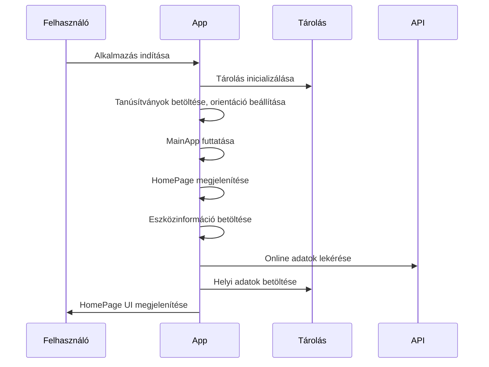
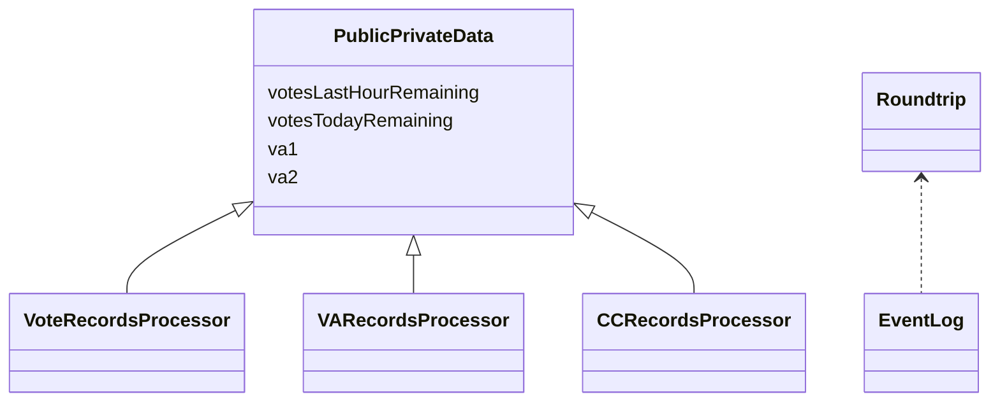
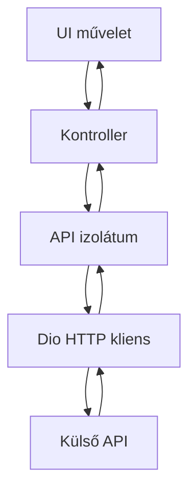
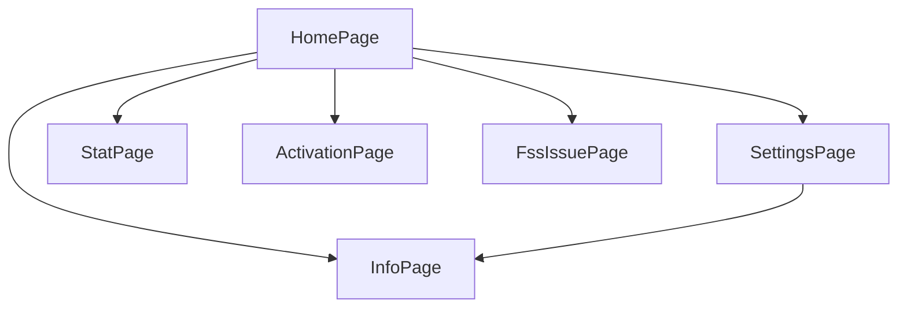

# DBR Index Projekt Dokumentáció

## 1. Projekt áttekintés & Architektúra

A **DBR Index** egy többplatformos Flutter alkalmazás Android, iOS, Windows, macOS, Linux és Web platformokra. Lehetővé teszi a DBR Index megtekintését, szavazást, részvétel kezelését. Funkciók: eszközinformáció-gyűjtés, biztonságos tárolás, API kommunikáció (izolátumokkal), lokalizáció, reszponzív UI.

### Architektúra diagram

## 2. Könyvtár- és fájlstruktúra

- **lib/**: Fő Dart forráskód (UI, kontrollerek, modellek, API logika)
- **assets/**: Képek, CSV-k, erőforrások
- **android/, ios/, windows/, linux/, macos/**: Platformspecifikus kód/konfig
- **web/**: Web build fájlok
- **test/**: Unit/widget tesztek
- **pubspec.yaml**: Projekt konfiguráció, függőségek
- **README.md**: Projekt bemutatás

### Könyvtárstruktúra diagram

## 3. Fő alkalmazásfolyam

1. Az alkalmazás a `main()`-ben indul (`lib/main.dart`)
2. Inicializálja a tárolást, tanúsítványokat, eszköz orientációt
3. Elindítja a `MainApp` widgetet, betölti a `MainFrame`-et
4. A `HomePage` betölti az eszközinformációkat, ellenőrzi a hálózatot, betölti az adatokat
5. A UI frissül árfolyamokkal, szavazással, felhasználói adatokkal

### Indítási szekvencia

## 4. Fő adatmodellek

- **PublicPrivateData**: Felhasználói és szavazási adatok
- **Roundtrip**: API roundtrip naplók
- **EventLog**: Alkalmazás eseménynaplók
- **VoteRecordsProcessor**: Szavazási rekordok
- **VARecordsProcessor**: Voting assistant rekordok
- **CCRecordsProcessor**: Kredit/kupon rekordok

### Adatmodell kapcsolatok

## 5. Hálózatkezelés & izolátumok

A hálózati kéréseket a `dio` csomag kezeli. Az API hívások izolátumokban futnak (`lib/apinetisolates/`). Minden API művelethez dedikált izolátum kontroller tartozik, amely kezeli az újrapróbálást és hibakezelést.

### Izolátum-alapú API hívás folyamata

## 6. Állapotkezelés

Az állapotot **globális konfiguráció** (`lib/controllers/globalconfig.dart`), **helyi tárolás** (shared_preferences, secure storage) és **memóriabeli állapot** (widgetekben) kezeli.

## 7. UI oldalak és navigáció

- **HomePage**: Főoldal, szavazás, árfolyamok
- **SettingsPage**: Beállítások, nyelv, VA konfiguráció
- **InfoPage**: Alkalmazás információ, verzió, eszközadatok
- **StatPage**: Statisztika, előzmények
- **ActivationPage**: Aktivációs kód megadása
- **FssIssuePage**: Adat-visszaállítás figyelmeztetés

### Navigációs folyamatábra

## 8. Szavazás és kapcsoló logika

A szavazást a `_pressVote` metódus kezeli a `HomePage`-en, amely izolátumon keresztül küldi a szavazatot a backendnek. A VA kapcsolók is hasonlóan működnek. Mindkettő frissíti a helyi állapotot és API hívást indít, hibák esetén párbeszédablak jelenik meg.

## 9. Tartós tárolás

A `shared_preferences` és `flutter_secure_storage` csomagokat használja felhasználói/eszköz adatok, szavazatok, beállítások, aktivációs kódok tárolására.

## 10. Lokalizáció és nyelvkezelés

A lokalizáció CSV fájlokkal történik (`assets/data/locales-keywords.csv`). Az alkalmazás futásidőben tölti be a nyelvi sztringeket, a felhasználó választhat nyelvet. A `Languages` kontroller kezeli a fordításokat.

## 11. Hibakezelés és naplózás

A hibák és naplók dedikált adat osztályokban gyűlnek, majd API izolátumokon keresztül kerülnek a backendre. A felhasználói hibák párbeszédablakban jelennek meg, a hálózati/szerver hibák naplózódnak.

## 12. Platformspecifikus részletek

- **Android:** `android/`, Gradle konfigurációk, AndroidManifest.xml
- **iOS:** `ios/`, Xcode projekt, Info.plist, storyboards
- **Windows/Linux/macOS:** `windows/`, `linux/`, `macos/`, CMake konfigurációk
- **Web:** `web/`, index.html, manifest.json

## 13. Build, futtatás és tesztelés

- Fordítás/futtatás: `flutter run`
- Platformra fordítás: `flutter build <platform>`
- Tesztelés: `flutter test`

## 14. Erőforrások

Erőforrások: képek (ikonok), lokalizációs CSV-k, tanúsítványok. A `pubspec.yaml`-ban hivatkozva, futásidőben töltődnek be.

## 15. Biztonság

Az érzékeny adatok (`API` kulcsok, eszköz ID-k) a `flutter_secure_storage`-ban tárolódnak, sosem kerülnek a UI-ba. A backenddel való kommunikáció HTTPS-en keresztül történik, eszközinformáció csak szükség esetén kerül elküldésre.

## 16. Bővítés és karbantartás

- Kövesd a moduláris struktúrát (kontrollerek, modellek, UI widgetek)
- Új funkciókat külön widgetben/kontrollerben adj hozzá
- Frissítsd a lokalizációs fájlokat új UI szövegekhez
- Írj teszteket a `test/` könyvtárba
- Tartsd naprakészen a függőségeket a `pubspec.yaml`-ban