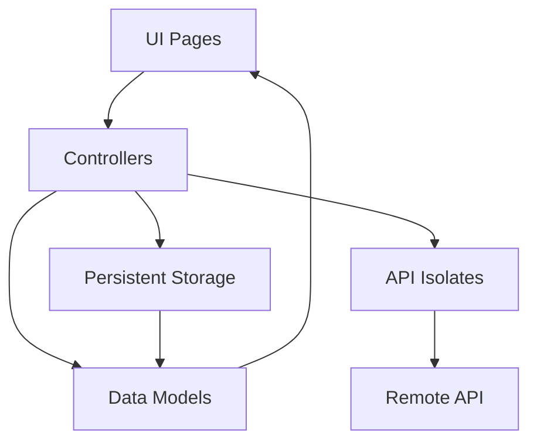
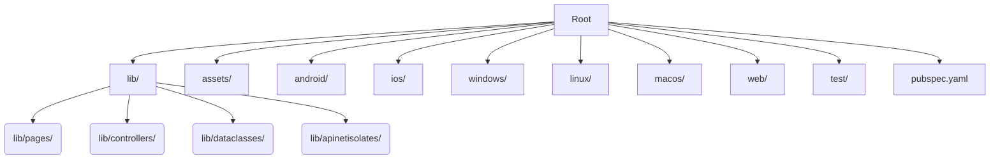
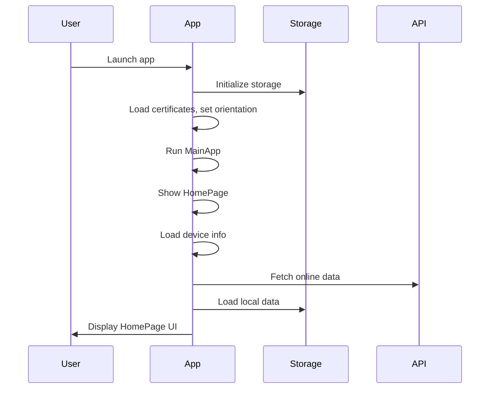
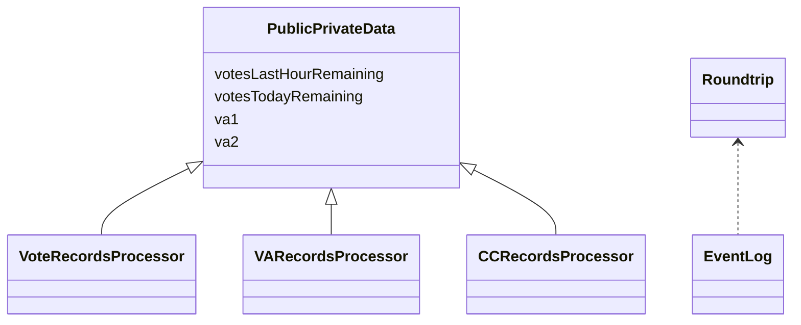
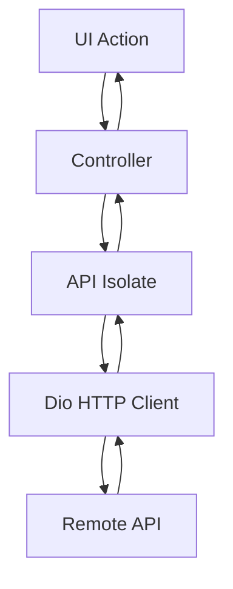
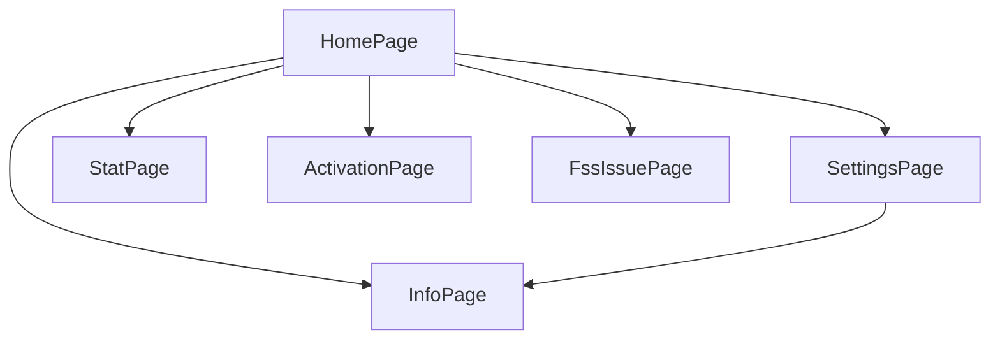

# DBR Index Project Documentation

## 1. Project Overview & Architecture

**DBR Index** is a cross-platform Flutter app for Android, iOS, Windows, macOS, Linux, and Web. It lets users view the DBR Index, vote, and manage participation. Features include device info collection, secure storage, API communication (with isolates), localization, and responsive UI.

### Architecture Diagram

## 2. Directory and File Structure

- **lib/**: Main Dart source (UI, controllers, models, API logic)
- **assets/**: Images, CSVs, resources
- **android/, ios/, windows/, linux/, macos/**: Platform-specific code/configs
- **web/**: Web build files
- **test/**: Unit/widget tests
- **pubspec.yaml**: Project config/dependencies
- **README.md**: Project intro

### Directory Structure Diagram

## 3. Main Application Flow

1. App starts in `main()` (`lib/main.dart`)
2. Initializes storage, certificates, device orientation
3. Runs `MainApp` widget, loads `MainFrame`
4. `HomePage` loads device info, checks network, loads data
5. UI updates with rates, voting, user info

### Startup Sequence

## 4. Core Data Models

- **PublicPrivateData**: User and voting data
- **Roundtrip**: API roundtrip logs
- **EventLog**: App event logs
- **VoteRecordsProcessor**: Voting records
- **VARecordsProcessor**: Voting assistant records
- **CCRecordsProcessor**: Credit/coupon records

### Data Model Relationships

## 5. Networking & Isolates

Network requests use `dio`. API calls run in Dart isolates (`lib/apinetisolates/`). Each API operation has a dedicated isolate controller for retries and error handling.

### Isolate-based API Call Flow

## 6. State Management

State is managed via **global config** (`lib/controllers/globalconfig.dart`), **local storage** (shared_preferences, secure storage), and **in-memory state** in widgets.

## 7. UI Pages and Navigation

- **HomePage**: Dashboard, voting, rates
- **SettingsPage**: Settings, language, VA config
- **InfoPage**: App info, version, device details
- **StatPage**: Statistics/history
- **ActivationPage**: Activation code entry
- **FssIssuePage**: Data reset warning

### Navigation Flowchart

## 8. Voting and Switch Logic

Voting is handled by `_pressVote` in `HomePage`, sending votes to the backend via isolate. VA switches are managed similarly. Both update local state and trigger API calls, with dialogs for errors.

## 9. Persistent Storage

Uses `shared_preferences` and `flutter_secure_storage` for user/device data, votes, settings, activation codes.

## 10. Localization and Language Handling

Localization uses CSV files in `assets/data/locales-keywords.csv`. The app loads language strings at runtime; users can select language. The `Languages` controller manages translations.

## 11. Error Handling and Logging

Errors/logs are collected in data classes and sent to the backend via API isolates. User errors show dialogs; network/server issues are logged.

## 12. Platform-Specific Details

- **Android:** `android/`, Gradle configs, AndroidManifest.xml
- **iOS:** `ios/`, Xcode project, Info.plist, storyboards
- **Windows/Linux/macOS:** `windows/`, `linux/`, `macos/`, CMake configs
- **Web:** `web/`, index.html, manifest.json

## 13. Build, Run, and Test

- Build/run: `flutter run`
- Build for platform: `flutter build <platform>`
- Test: `flutter test`

## 14. Assets and Resources

Assets: images (icons), CSVs for localization, certificates. Referenced in `pubspec.yaml`, loaded at runtime.

## 15. Security

Sensitive data (API keys, device IDs) stored in `flutter_secure_storage`, never hardcoded. Backend uses HTTPS; device info sent only as needed.

## 16. Extending and Maintaining

- Follow modular structure (controllers, models, UI widgets)
- Add features in separate widgets/controllers
- Update localization files for new UI text
- Write tests in `test/`
- Keep dependencies up to date in `pubspec.yaml`