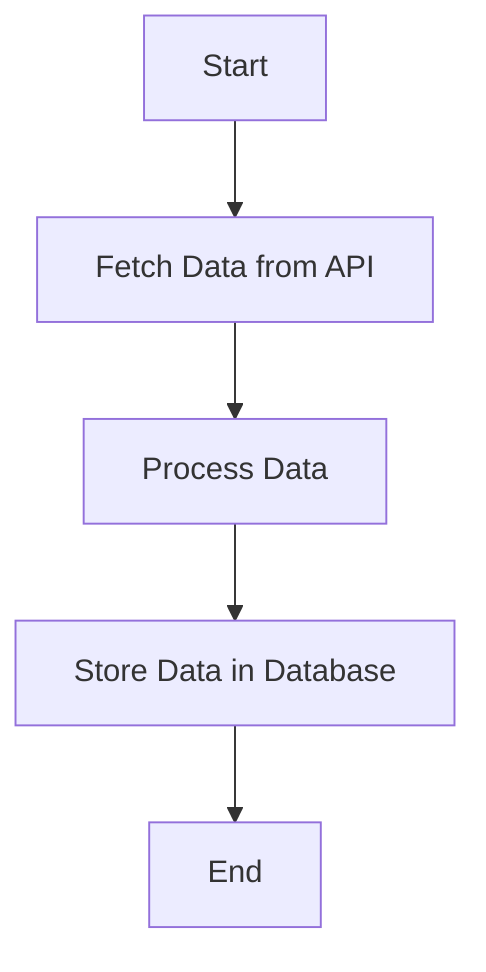
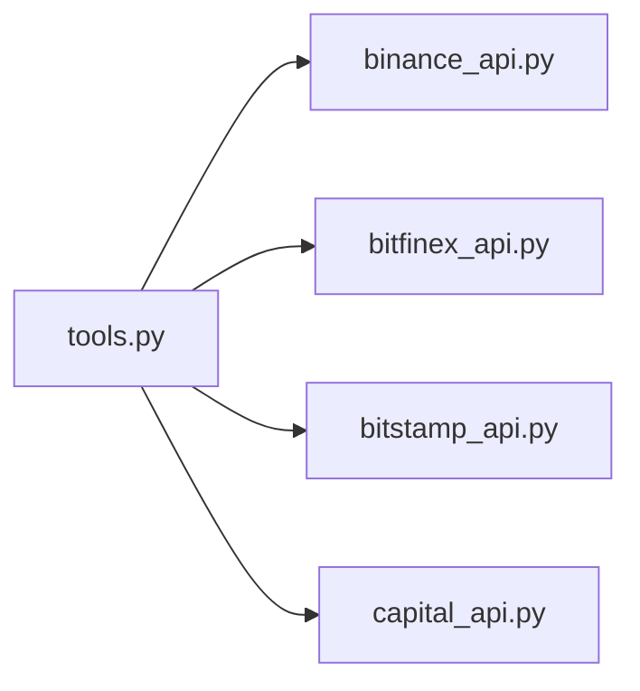
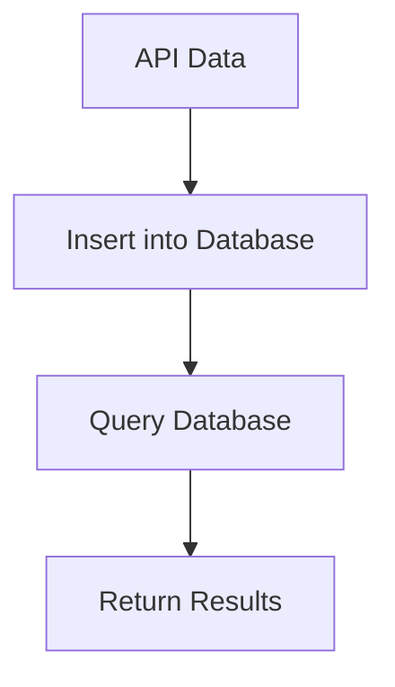

# RC Smarti Me Documentation

## Project Overview

RC Smarti Me is a Python-based project designed to interact with multiple financial APIs (Binance, Bitfinex, Bitstamp, Capital) to fetch real-time data, process it, and store it in a database. It provides tools for logging, error handling, and database management, ensuring seamless integration and data reliability.

This project is ideal for developers and financial analysts who need to work with real-time financial data and perform historical analysis.

**Technologies used:** `Python, MySQL, Binance, Bitfinex, Bitstamp, and Capital APIs.`

---

## Installation Instructions

### Prerequisites

- Python 3.8 or newer
- MySQL database
- `pip` for dependency management

### Steps

1. **Clone the repository:**
    ```bash
    git clone https://github.com/username/rc.smarti.me.git
    cd rc.smarti.me
    ```
2. **Install dependencies:**
    ```bash
    pip install -r requirements.txt
    ```
3. **Set up environment variables:**
    - Create a `.env` file in the root directory with:
    ```
    WEBHOOK_URL             =       <your_discord_webhook_url>
    MYSQL_HOST              =       <your_database_host>
    MYSQL_USER              =       <your_database_user>
    MYSQL_PASSWORD          =       <your_database_password>
    MYSQL_DATABASE_RATES    =       <your_database_name>
    CAPITAL_API_KEY         =       <your_capital_api_key>
    CAPITAL_IDENTIFIER      =       <your_capital_identifier>
    CAPITAL_PASSWORD        =       <your_capital_password>
    CAPITAL_WATCHLIST_ID    =       <your_watchlist_id>
    ```
4. **(Optional) Set up a virtual environment:**
    ```bash
    python -m venv venv
    source venv/bin/activate
    ```

---

## Usage

### Running the Project

To start fetching data from APIs and storing it in the database:
```bash
python main.py
```

### Testing API Uptime

Run the uptime test script for Binance:
```bash
python binance_api/uptime_test.py
```

#### Example Output

```json
{
    "symbol": "BTCUSDT",
    "price": "35000.00"
}
```

---

## Folder and File Structure

```
.
├── allratesinput
│   ├── credentials.py
│   ├── logging_config.py
│   ├── tools.py
├── binance_api
│   ├── binance_api.py
│   ├── uptime_test.py
├── bitfinex_api
│   ├── bitfinex_api.py
├── bitstamp_api
│   ├── bitstamp_api.py
├── capital_api
│   ├── capital_api.py
├── requirements.txt
├── main.py
└── .env
```

**Explanation:**
- `allratesinput`: Shared utilities, logging, and credentials management.
- `binance_api`: Binance API integration.
- `bitfinex_api`: Bitfinex API integration.
- `bitstamp_api`: Bitstamp API integration.
- `capital_api`: Capital API integration.
- `requirements.txt`: Python dependencies.
- `main.py`: Project entry point.
- `.env`: Environment variables.

---

## Functions and Methods

### Shared Functions

- `setup_logging(info_log_path, error_log_path, debug=False, name="")`: Configures logging with rotating file handlers.
- `add_pid_to_file(filename, pid, path)`: Stores process IDs in a file.
- `send_message_to_dc(webhook_url, message_content, logger)`: Sends messages to Discord via webhook.
- `send_msg_on_socket(msg, port, file_path, pid)`: Sends formatted messages to a socket for error handling.
- `format_date_time(now_date_secs)`: Formats date/time as a `datetime` object.
- `log_elapsed_time(logger)`: Decorator for logging function execution time.
- `retry(max_retries, initial_delay, backoff_factor, exceptions, logger)`: Decorator for retrying operations with exponential backoff.

### API-Specific Functions

- `get_data_from_binance(url, params)`: Fetches data from Binance API.
- `get_data_from_bitfinex(url, headers)`: Fetches data from Bitfinex API.
- `get_data_from_bitstamp(url, headers)`: Fetches data from Bitstamp API.
- `get_data_from_capital(security_token, cst, watchlist_id)`: Fetches data from Capital API.
- `insert_data_into_db(data, time_as_date_time, instrument_name)`: Inserts fetched data into the database.

---

## Architecture

### Workflow Diagram



### Component Interaction



### Database Operations



---

## Features

- Fetch real-time financial data from Binance, Bitfinex, Bitstamp, and Capital APIs.
- Store data in a MySQL database for historical analysis.
- Log errors and send notifications to Discord.
- Retry failed operations automatically.
- Modular design for easy integration with additional APIs.

---

## Contributing

We welcome contributions! Steps:

1. Fork the repository.
2. Create a new branch:
    ```bash
    git checkout -b feature-name
    ```
3. Commit your changes:
    ```bash
    git commit -m "Add feature-name"
    ```
4. Push to your fork:
    ```bash
    git push origin feature-name
    ```
5. Submit a pull request.

**Areas for Contribution:**
- Documentation improvements
- Adding support for new APIs
- Optimizing database operations
- Enhancing error handling and logging

---

## Testing

Run unit tests to verify functionality:
```bash
python -m unittest discover tests
```
Expected output:
```
Ran 10 tests in 0.05s
OK
```

---

## FAQ

- **What happens if an API fails?**  
  The project retries failed operations automatically using the `retry` decorator.

- **How do I add support for a new API?**  
  Create a new folder for the API, implement methods for data fetching, and integrate it with `tools.py`.

- **What should I do if the database connection fails?**  
  Check your environment variables and ensure the MySQL server is running.

---

## License

This project is licensed under the MIT License. See the `LICENSE` file for details.

---

## Contact

For questions or support, please contact [your_email@example.com](mailto:your_email@example.com).