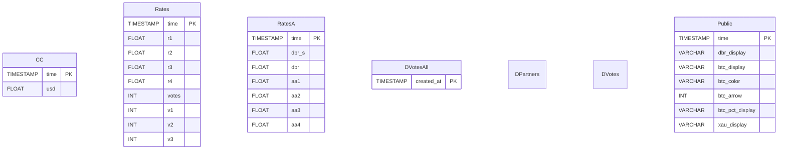

# dbrpp_db Project Documentation

## High-Level Overview

The **dbrpp_db** project is a data processing and database management system supporting a mobile application. It ingests, processes, and stores both public and private data, providing up-to-date statistics and analytics. The system is composed of several Python modules for `data loading, calculation, database access, and logging`, orchestrated by the `dbrpp_calc` script, which can be run in various modes `(debug, run, schedule)`.

## Setup and Installation

1. Clone the repository and navigate to the project directory.
2. Install dependencies:
   ```
   pip install -r requirements.txt
   ```
3. Configure environment variables in `.env` as needed.
4. Refer to `README.md` for further instructions.

## Directory Structure

- `calculations.py`: Main data processing and calculation logic.
- `conf_log.py`: Logging configuration and initialization.
- `config.py`: Database and application configuration.
- `db.py`: Database connection and utility functions.
- `dbrpp_calc`: Main entry point script for running/scheduling the process.
- `loader.py`: Data loading and writing functions.
- `models.py`: SQLAlchemy ORM models for database tables.
- `Private.parquet`: Input data file for private data processing.
- `processes.json`: Tracks running processes for scheduling.
- `restart.sh`: Script to restart the main process.
- `logs/`: Directory for log files.
- `pl/`: Plugins or additional scripts.
- `results.md`: Output and results documentation.

## Running the Main Script

The main script is `dbrpp_calc`. It supports several modes:
- **schedule**: Runs the process in the background, scheduled every minute.
- **debug**: Runs in debug mode, writing to a test database if available.
- **run**: Runs the process once.

```
./dbrpp_calc --help
nohup ./dbrpp_calc -m schedule > logs/stdout.log 2>&1 &
./restart.sh
```

## Logging and Configuration

- **Logging** is set up in `conf_log.py` and used throughout the project. Log files are stored in `logs/`.
- **Configuration** (database URLs, credentials, etc.) is managed in `config.py` and `.env`.

## Database and Data Model

### SQLAlchemy Models (`models.py`)

- `CC`: Stores currency data (usd, time).
- `Rates`: Stores rates (r1, r2, r3, r4, time, votes, v1, v2, v3).
- `RatesA`: Stores alternative rates (dbr_s, dbr, aa1, aa2, aa3, aa4, time).
- `DVotesAll`: Tracks all votes (created_at, ...).
- `DPartners`: Partner data.
- `DVotes`: Individual vote data.
- `Public`: Aggregated public data (time, dbr_display, btc_display, btc_color, btc_arrow, btc_pct_display, xau_display, ...).

Each model maps to a table in the database, with fields, types, and constraints as defined in `models.py`.

### Private.parquet

`Private.parquet` is a Parquet file containing private data, loaded and processed by `loader.py` for further calculations and database insertion.

## Data Processing and Calculation

- **Main flow** is in `calculations.py` and orchestrated by `dbrpp_calc`.
- `count_public_data` and `count_private_data` functions aggregate, process, and format data for public and private outputs.
- `loader.py` handles reading from `Private.parquet` and writing processed data to the database.
- `db.py` provides database connection utilities and a `ConnectionHandler` class for executing queries.

## Testing and Validation

- `format_test.py` contains unit tests for data formatting and validation functions.
- Run tests using:
  ```
  python format_test.py
  ```

## Configuration and Logging

- `config.py`: Defines database URLs, credentials, and other settings.
- `conf_log.py`: Sets up logging format, level, and output files.

## Process and Workflow

- `processes.json`: Tracks running process IDs for scheduling and management.
- `restart.sh`: Shell script to restart the main process.
- Scheduling is handled by `schedule` in `dbrpp_calc` and can be run in the background using `nohup`.

## Results and Outputs

- Output files and logs are generated in the `logs/` directory.
- `results.md` documents output formats and results for reference.

## Mermaid Diagrams

### High-Level Architecture


### Database Schema (ER Diagram)



### Data Flow: Input to Database


### Main Data Processing Pipeline


### Script Execution Sequence


### Scheduling and Restart Workflow

