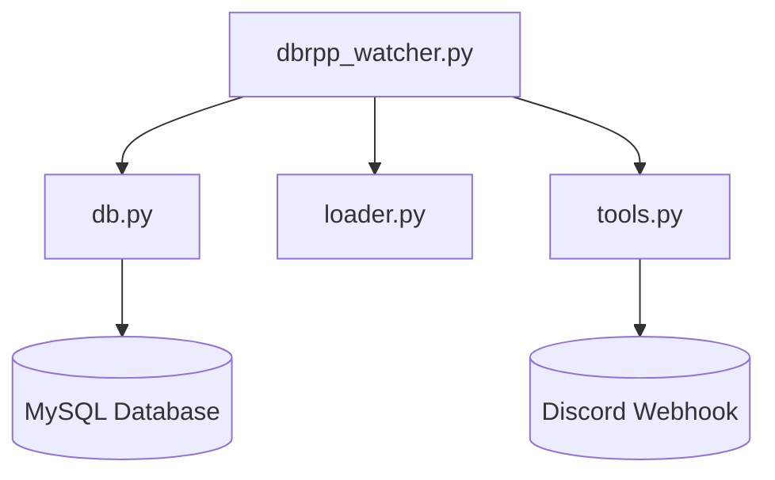
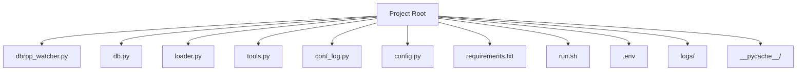
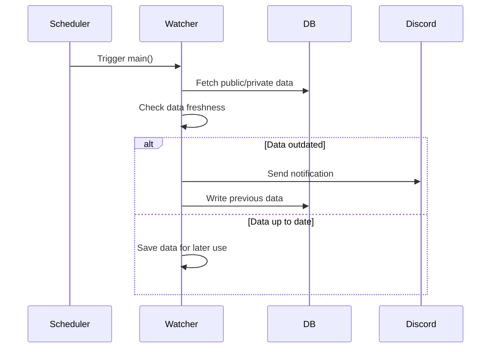

# dbrpp_watcher Project Documentation

## 1. Project Introduction

**Purpose:** The `dbrpp_watcher` project is a Python-based monitoring tool designed to periodically check the status and freshness of data in a MySQL database (specifically, the "dbrpp" database).  

**Problem Solved:** It automates the detection of data outages or staleness, notifies stakeholders via Discord, and ensures that both public and private data are kept up to date.  

**Target Audience:** Database administrators, data engineers, and operations teams responsible for the "dbrpp" data pipeline.  

**Main Features:**
- Scheduled checks for public and private data freshness
- Automatic notification to Discord on issues
- Graceful shutdown and process management
- Custom logging with log rotation
- Configurable via environment variables

## 2. Architecture Overview

The project is structured around a main watcher script that orchestrates database checks, logging, notifications, and scheduling. It interacts with helper modules for database access, logging, configuration, and utility functions.

- `dbrpp_watcher.py`: Main entry point, scheduling, and orchestration
- `db.py`: Database connection management
- `loader.py`: Data loading and writing logic
- `tools.py`: Utilities for notifications, PID management, and signal handling
- External services: MySQL database, Discord webhook

**Architecture Diagram:**



## 3. File and Directory Structure

- `dbrpp_watcher.py`: Main watcher script
- `db.py`: Database connection handler
- `loader.py`: Data loading/writing functions
- `tools.py`: Utility functions (notifications, PID, signals)
- `conf_log.py`: Logging configuration
- `config.py`: Loads configuration from `.env`
- `requirements.txt`: Python dependencies
- `run.sh`: Shell script to start the watcher
- `.env`: Environment variables for DB and webhook
- `logs/`: Log files (rotated)
- `__pycache__/`: Python bytecode cache

**Directory Structure Diagram:**



## 4. Configuration

- `.env` file: Contains DB credentials, webhook URL, and base URL
- `config.py`: Loads and exposes these settings

**Required options:** All MySQL connection parameters and `DC_WEBHOOK_URL`.  
**Setup:** Copy `.env` to the project root and fill in your credentials.

```env
MYSQL_PORT            =   3306
MYSQL_HOST_DBR        =   "localhost"
MYSQL_USER_DBR        =   "user"
MYSQL_PASSWORD_DBR    =   "password"
MYSQL_DATABASE_DBR    =   "DBR"
...
DC_WEBHOOK_URL        =   "https://discord.com/api/webhooks/..."
```

## 5. Logging

- Logging is initialized via `conf_log.py` and `init_log()`
- Logs are written to `logs/` directory, with rotation for both log and error files
- Logging level and format can be changed in `dbrpp_watcher.py` and `conf_log.py`

## 6. Database Integration

- Database connections are managed by `ConnectionHandler` in `db.py`
- Connects to MySQL using credentials from `.env`
- Interacts with tables in the `dbrpp` database for both public and private data

## 7. Scheduling and Main Loop

- Uses the `schedule` library to run `main()` every minute at a specific second offset
- Each run fetches public and private data, checks freshness, and triggers notifications if needed

**Scheduled Run Sequence Diagram:**



## 8. Signal Handling and Process Management

- Handles `SIGINT` and `SIGTERM` using `custom_signal_handler` in `tools.py`
- Tracks its own PID in a JSON file for process management
- On graceful shutdown, logs the event and cleans up as needed

## 9. Notifications

- Notifications are sent to Discord via `send_message_to_dc` in `tools.py`
- Triggered when data is outdated or on certain errors
- Webhook URL is configured in `.env` as `DC_WEBHOOK_URL`

## 10. Data Loading and Writing

- `send_private_data_bin`: Sends private data as a binary file
- `send_public_data`: Sends public data
- `db_writer_pub`: Writes public data to the database
- `db_writer_priv_df`: Writes private data to the database

## 11. Error Handling

- Errors are logged to `logs/*.err` files
- Critical errors may trigger Discord notifications
- Logs can be reviewed for troubleshooting

## 12. Deployment and Running

- Install dependencies: `pip install -r requirements.txt`
- Set up `.env` with your configuration
- Start the watcher: `./run.sh` or run `python dbrpp_watcher.py`
- Monitor logs in `logs/` for status and errors

## 13. Extending and Customizing

- Add new data checks by extending `main()` or adding new functions in `loader.py`
- Add new notification channels by implementing additional functions in `tools.py`
- Add new config options in `.env` and `config.py`

## 14. Testing

- No explicit tests are present by default
- Add tests using your preferred Python testing framework (e.g., `pytest`)
- Run tests with `pytest` or similar tools

## 15. Glossary

- **dbrpp**: The target MySQL database being monitored
- **Watcher**: The main process that checks data freshness
- **Public/Private Data**: Different data sets managed by the watcher
- **Discord Webhook**: URL endpoint for sending notifications to Discord
- **PID**: Process ID, used for tracking running instances
- **Schedule**: Python library for periodic task scheduling