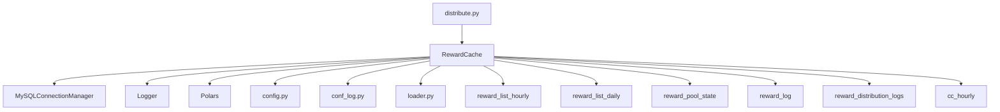
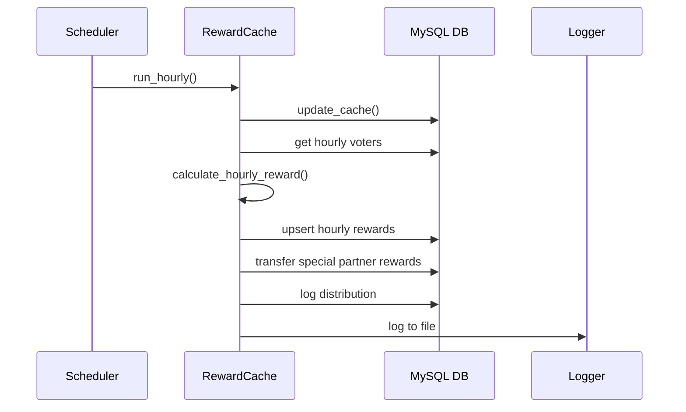
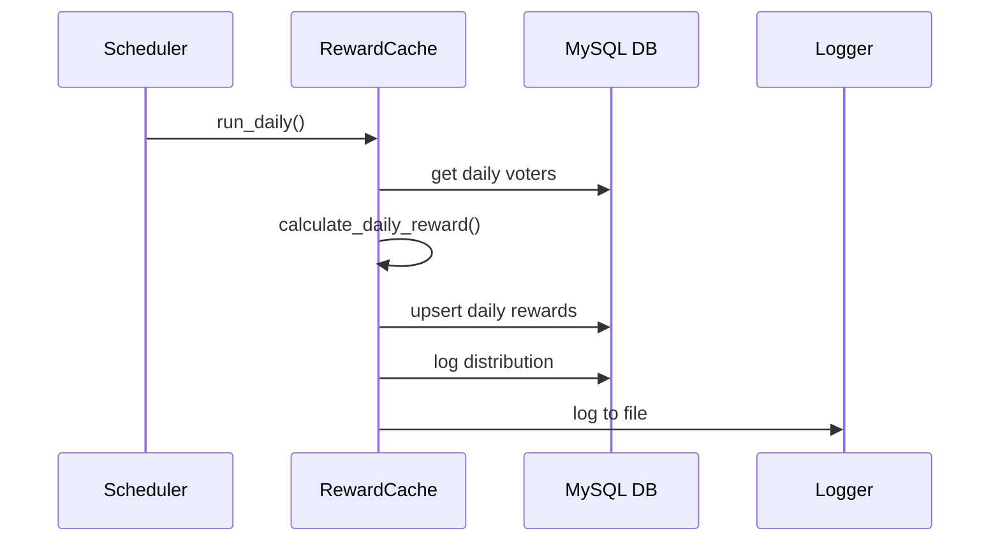
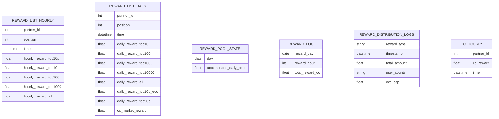
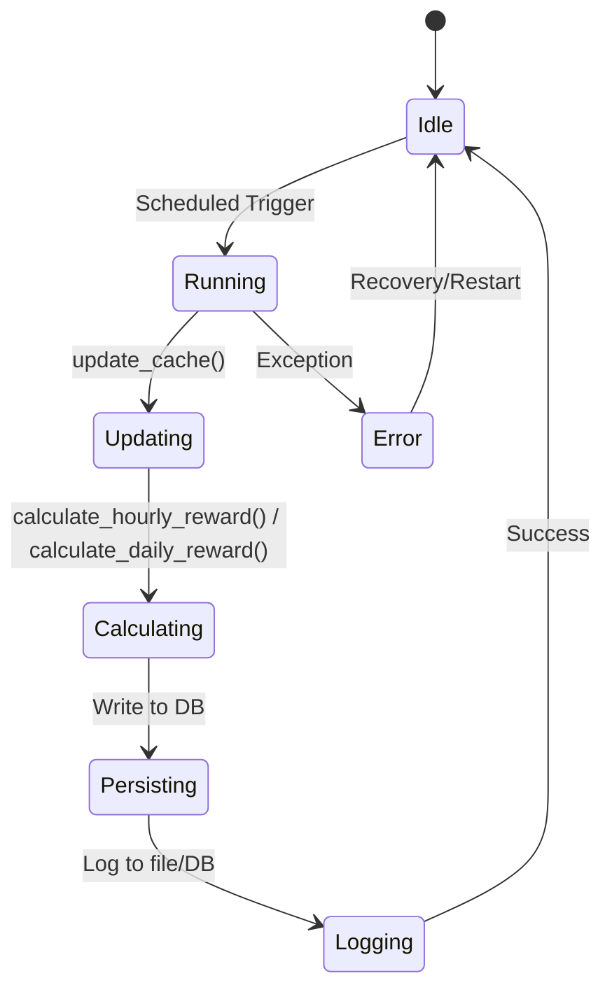

# Reward Distribution System

## Project Purpose & Overview

The Reward Distribution System automates the calculation and distribution of rewards to partners based on their voting activity. Its main users are operators of a partner program and the partners themselves. The system solves the business problem of fair, transparent, and auditable reward allocation based on participation, using a mix of fixed and dynamic rules.

**Purpose:**
- Automates hourly and daily reward calculations
- Tracks voter participation and eligibility
- Persists results to MySQL databases for auditing and reporting
- Handles special partners with custom reward logic
- Provides logging, monitoring, and safe restart capabilities

## Architecture

### High-Level Components

- **distribute.py**: Main logic, scheduler, and the `RewardCache` class
- **db.py**: MySQL connection manager
- **config.py**: Database and system configuration
- **conf_log.py**: Logging setup
- **loader.py**: Data loading utilities

### Component Interaction

- `RewardCache` orchestrates reward calculation, database operations, and logging
- Uses `MySQLConnectionManager` from **db.py** for all DB access
- Configuration and logging are loaded from their respective modules

### Data Flow

1. Voting data is collected from the database
2. Reward pools are updated based on recent voting and CC rates
3. Hourly and daily rewards are calculated and distributed using tiered logic
4. Results are persisted to MySQL tables for auditing and further processing
5. Special partners receive additional reward transfers
6. Logs are written for all major actions and distributions

## Database

### Key Tables & Schemas

| Table                     | Description                        | Key Fields                                                                                      |
|---------------------------|------------------------------------|-------------------------------------------------------------------------------------------------|
| `reward_list_hourly`      | Stores hourly reward distributions | partner_id, position, time, hourly_reward_top10p, hourly_reward_top10, hourly_reward_top100, hourly_reward_top1000, hourly_reward_all |
| `reward_list_daily`       | Stores daily reward distributions  | partner_id, position, time, daily_reward_top10, daily_reward_top100, daily_reward_top1000, daily_reward_top10000, daily_reward_all, daily_reward_top10p_ecc, daily_reward_top50p, cc_market_reward |
| `reward_pool_state`       | Tracks accumulated daily rewards   | day, accumulated_daily_pool                                                                     |
| `reward_log`              | Audit log of all distributions     | reward_day, reward_hour, total_reward_cc, ... (various counts and amounts)                      |
| `reward_distribution_logs`| JSON logs of each distribution event | reward_type, timestamp, total_amount, user_counts, ecc_cap                                      |
| `cc_hourly`               | Special partner reward transfers   | partner_id, cc_reward, time                                                                     |

### Database Access

- **Reads:** Voting data, CC rates, and previous pool states are read via SQL queries
- **Writes:** Rewards, logs, and pool states are written using upserts and inserts
- **Special partners:** Hourly rewards are summed and transferred to a remote database

## Reward Logic

### Hourly Rewards

- **Pool is divided into 5 equal categories:** top 10%, top 10, top 100, top 1000, all
- Rewards are assigned based on partner position in the voting results
- **Eligibility:** Only partners who voted in the last hour are included

### Daily Rewards

- ECC cap is calculated as 5x the average ECC of the top 10% partners
- **Pool is split into:**
    - Fixed position rewards (top tiers, require minimum votes)
    - ECC-based rewards (weighted by capped ECC)
    - Top 50% participation rewards
    - CC market rate bonus
- **Eligibility:** Minimum vote requirements and participation thresholds

### Special Partners

- Partners in `SPECIFIC_PARTNERS` have their hourly rewards summed and transferred to a remote database

## Scheduling & Automation

- Uses the `schedule` library for timed execution
- Hourly rewards: triggered every hour at :30
- Daily rewards: triggered every day at 00:00:35
- Test mode: Set `TEST = True` in `distribute.py` to run a single cycle
- Graceful shutdown and process tracking via signal handlers and `processes.json`
- Failures: Transactions are rolled back and errors logged; state is persisted for safe restart

## Configuration & Environment

- **config.py**: Database connections and system parameters
- **conf_log.py**: Logging configuration
- **.env**: (Optional) Environment variables for sensitive data
- Database credentials and table names must be set in `config.py`

## Logging & Monitoring

- All major actions and errors are logged to file (see `logs/` directory)
- Reward distributions are also logged to the `reward_distribution_logs` table
- Detailed per-partner vote counts are logged at DEBUG level
- Graceful shutdown and log flushing via signal handlers

## Extending & Customizing

- To add new reward tiers or change logic, modify `calculate_hourly_reward` and `calculate_daily_reward` in `RewardCache`
- To support new partner types or voting rules, update SQL queries and reward assignment logic
- For new logging or monitoring, extend `log_distribution` or add new logging calls

## Deployment & Operations

- **Requirements:** Python 3.8+, MySQL, dependencies in `requirements.txt`
- **Deploy:** Run `python distribute.py` as a scheduled service
- **Stop/Restart:** Use process tracking in `processes.json` and signal handlers for safe shutdown
- **Upgrade:** Stop the service, update code/dependencies, restart

## Testing

- Unit tests can be added in `test_calc.py`
- Set `TEST = True` in `distribute.py` for test mode
- Use test databases and mock data for safe testing
- Performance tests can be run with large datasets

## Mermaid Diagrams

### Component Diagram

### Sequence Diagram: Hourly Reward Distribution

### Sequence Diagram: Daily Reward Distribution

### Entity-Relationship Diagram (ERD)

### State Diagram: Reward Pools

### Flowchart: update_cache, calculate_hourly_reward, calculate_daily_reward

```mermaid
flowchart TD
    subgraph update_cache
        A1[Start] --> B1[Get last hour's CC votes]
        B1 --> C1[Get voter count]
        C1 --> D1[Get current CC rate]
        D1 --> E1[Distribute: 25% hourly, 75% daily]
        E1 --> F1[Save daily pool]
        F1 --> G1[End]
    end
    subgraph calculate_hourly_reward
        A2[Start] --> B2[Get hourly voters]
        B2 --> C2{Any voters?}
        C2 -- No --> D2[Log empty]
        C2 -- Yes --> E2[Divide pool into 5 categories]
        E2 --> F2[Assign rewards by position]
        F2 --> G2[Upsert to DB]
        G2 --> H2[Transfer special partners]
        H2 --> I2[Log distribution]
        I2 --> J2[End]
    end
    subgraph calculate_daily_reward
        A3[Start] --> B3[Get daily voters]
        B3 --> C3{Any voters?}
        C3 -- No --> D3[Log empty]
        C3 -- Yes --> E3[Calculate ECC cap]
        E3 --> F3[Split pool into 3 categories]
        F3 --> G3[Apply vote requirements]
        G3 --> H3[Calculate fixed position rewards]
        H3 --> I3[Calculate ECC-based rewards]
        I3 --> J3[Calculate top 50% rewards]
        J3 --> K3[Add market bonus]
        K3 --> L3[Upsert to DB]
        L3 --> M3[Log distribution]
        M3 --> N3[End]
    end
```

