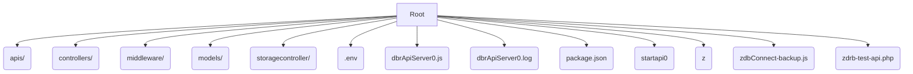
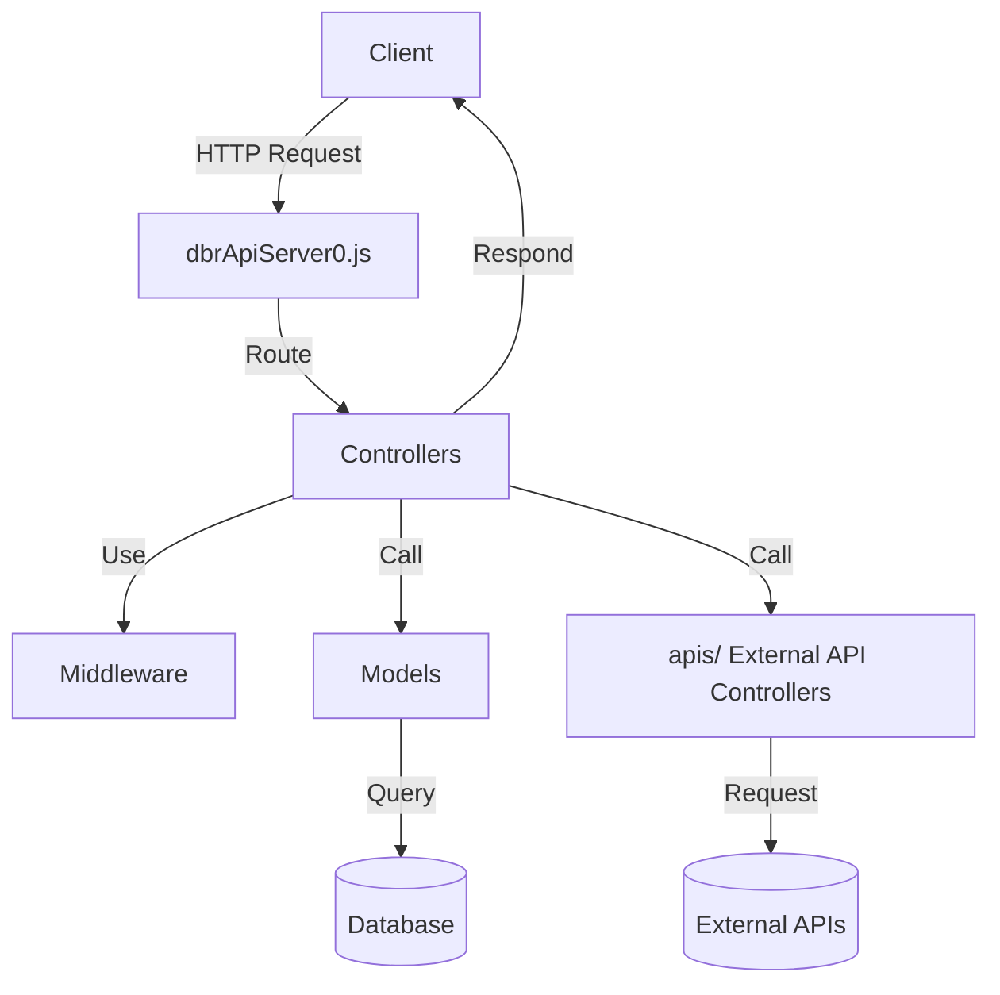
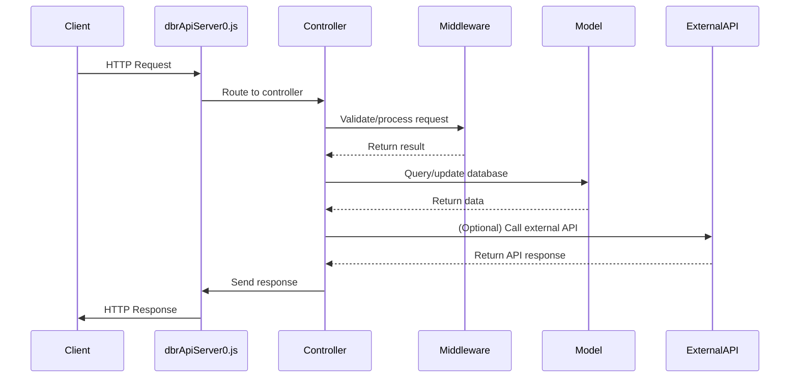
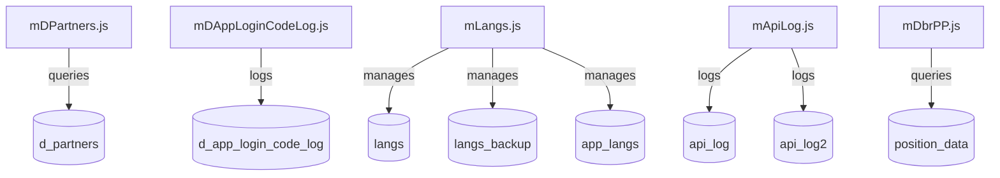
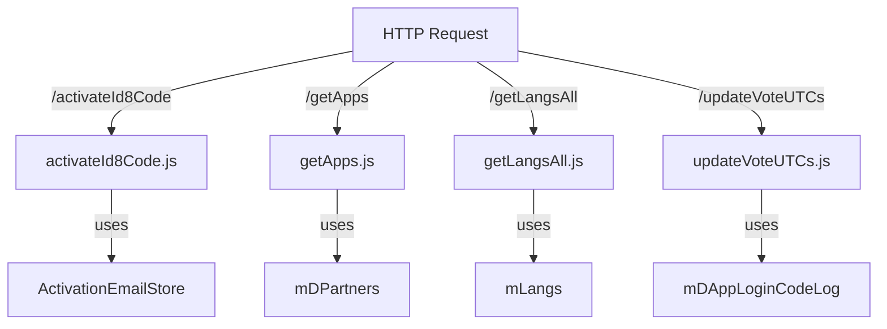
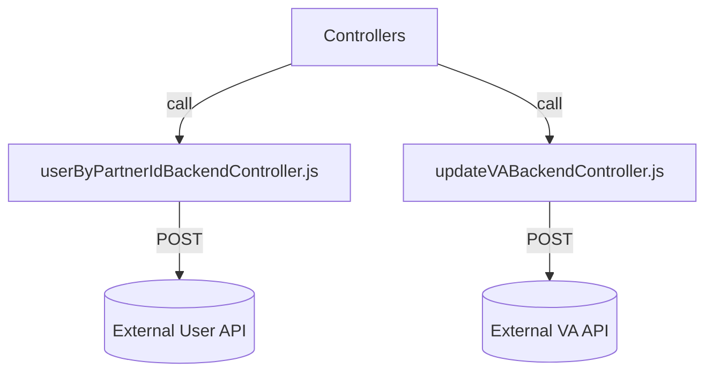

# dbrapi0.smarti.me – Backend API Server

## Overview

**dbrapi0.smarti.me** is a Node.js backend API server designed to manage activation codes, user management, voting, language localization, and integration with external services. The project is structured for modularity, maintainability, and scalability, with clear separation between routing, business logic, database access, and utility functions.

---

## Table of Contents

- [Project Structure](#project-structure)
- [Folder and File Descriptions](#folder-and-file-descriptions)
- [API Endpoints](#api-endpoints)
- [Database Models](#database-models)
- [Configuration](#configuration)
- [Startup and Deployment](#startup-and-deployment)
- [Example Data Flow](#example-data-flow)
- [Utility and Legacy Scripts](#utility-and-legacy-scripts)
- [Architecture Diagrams (Mermaid)](#architecture-diagrams-mermaid)
- [Contributing](#contributing)
- [License](#license)

---

## Project Structure

```
.
├── apis/
├── controllers/
├── middleware/
├── models/
├── storagecontroller/
├── .env
├── dbrApiServer0.js
├── dbrApiServer0.log
├── package.json
├── startapi0
├── z
├── zdbConnect-backup.js
├── zdrb-test-api.php
```

---

## Folder and File Descriptions

### Root Directory

- **.env**  
  Environment variables for database connections, API keys, and configuration.

- **dbrApiServer0.js**  
  Main entry point. Sets up the HTTP server, parses requests, and routes them to controllers.

- **dbrApiServer0.log**  
  Log file for server output and errors.

- **package.json**  
  Node.js project manifest (dependencies, scripts, metadata).

- **startapi0**  
  Shell script to start the server with `nodemon` and redirect logs.

- **z**  
  Shell script to compress the log file.

- **zdbConnect-backup.js**  
  Utility for database connection and queries (backup or testing).

- **zdrb-test-api.php**  
  Legacy PHP script for testing or integration.

---

### apis/

Backend controllers for interacting with external APIs or backend services.

- **updateVABackendController.js**  
  Sends HTTPS POST requests to update Voting Assistant (VA) status.

- **userByPartnerIdBackendController.js**  
  Handles user-related backend API calls by partner ID.

- **webAppBackendController.js**  
  Sends vote requests to the web app backend.

- **webAppPositionBackendController.js**  
  Handles position-related backend API calls.

- **webAppVABackendController.js**  
  Sends VA-related requests to the web app backend.

---

### controllers/

Route handlers for each API endpoint.

- **activateId8Code.js**  
  Handles activation of ID8 codes.

- **activateId8CodeDetails5b9e3c2.js**  
  Handles activation with additional details.

- **activateId8CodePartnerIdDetails.js**  
  Handles activation with partner ID and details.

- **activateId8CodeWithDetails.js**  
  Handles activation with more detailed information.

- **getAllLast2Rows.js**  
  Fetches the last two rows from a data source.

- **getApps.js**  
  Returns a list of applications.

- **getLangsAll.js**  
  Returns all language records.

- **storeLangs.js**  
  Handles storing and updating language records.

- **storeAppLangs.js**  
  Handles storing and updating application-specific language records.

- **getPPRRP.js, getPRRP.js**  
  Fetches position or public data with redundancy/retry logic.

- **getVASwitch.js, getVASwitchRRP.js**  
  Handles VA switch state retrieval.

- **updateVASwitch.js, updateVASwitchVPH.js**  
  Handles updating VA switch state.

- **updateVoteUTCs.js**  
  Handles updating votes with UTC timestamps.

- **getPublicData.js, getPublicDataRRP.js**  
  Fetches public data, possibly with redundancy/retry.

---

### middleware/

Reusable logic for request processing, validation, and utility functions.

- **activationEmailStore.js**  
  Handles storing and updating email/UDID pairs, generating unique codes, and logging.

- **requestCounter.js**  
  Tracks API request counts.

- **requestRetryCounter.js**  
  Tracks API retry counts.

---

### models/

Database access logic for various tables.

- **dbQuery.js**  
  Core database query functions.

- **mDPartners.js**  
  Handles queries and updates for the `d_partners` table (e.g., voting assistant status).

- **mDAppLoginCodeLog.js**  
  Handles logging of app login codes and email/UDID pairs.

- **mApiLog.js**  
  Handles API logging, supports multiple log tables.

- **mDbrPP.js**  
  Handles queries for position and public data.

- **mLangs.js**  
  Handles language records, including backup, replace, and app-specific language management.

- **mAppBeApiRequests.js**  
  Tracks backend API requests per minute.

- **mDbrAppBeApiProcess.js**  
  Tracks backend API processing times.

- **mDbrAppBeApiRR.js**  
  Tracks backend API retry requests.

---

### storagecontroller/

Handles file storage and retrieval.

- **readJson.js**  
  Reads JSON files from disk, used for serving public data.

---

## API Endpoints

Each controller in the `controllers/` folder typically exposes one or more endpoints.  
**Example endpoint documentation:**

### `POST /activateId8Code`
- **Description:** Activates an ID8 code for a user.
- **Request Body:**  
  - `email` (string): User email  
  - `udid` (string): Device UDID  
  - `partnerId` (string, optional): Partner identifier  
- **Response:**  
  - `status` (string): Success or error  
  - `code` (string): Activation code  
- **Errors:**  
  - `400`: Missing parameters  
  - `500`: Internal server error

*(Repeat for each endpoint as needed.)*

---

## Database Models

Models in the `models/` folder encapsulate all database access.

- **mDPartners.js:**  
  - Table: `d_partners`  
  - Operations: Query/update voting assistant status, partner info.

- **mDAppLoginCodeLog.js:**  
  - Table: `d_app_login_code_log`  
  - Operations: Log app login codes, email/UDID pairs.

- **mLangs.js:**  
  - Tables: `langs`, `langs_backup`, `app_langs`  
  - Operations: Manage language records, backup/restore, app-specific languages.

- **mApiLog.js:**  
  - Tables: `api_log`, `api_log2`, ...  
  - Operations: Log API requests and responses.

*(Repeat for each model as needed.)*

---

## Configuration

### `.env` Example

```
DB_HOST=localhost
DB_USER=myuser
DB_PASS=mypassword
DB_NAME=mydatabase
API_KEY=your_api_key_here
LOG_PATH=./dbrApiServer0.log
```

- **DB_HOST, DB_USER, DB_PASS, DB_NAME:**  
  Database connection settings.

- **API_KEY:**  
  Key for authenticating with external services.

- **LOG_PATH:**  
  Path to the server log file.

---

## Startup and Deployment

1. **Install dependencies:**
   ```sh
   npm install
   ```

2. **Configure environment:**
   - Copy `.env.example` to `.env` and fill in your values.

3. **Start the server:**
   ```sh
   ./startapi0
   ```

4. **Log rotation:**
   - Use the `z` script to compress logs:
     ```sh
     ./z
     ```

---

## Example Data Flow

1. **Client** sends a request to `/activateId8Code`.
2. **Server** (`dbrApiServer0.js`) routes the request to `controllers/activateId8Code.js`.
3. **Controller** validates input, uses `middleware/activationEmailStore.js` to store email/UDID, and calls `models/mDAppLoginCodeLog.js` to log the activation.
4. **If needed**, controller calls an external API via `apis/userByPartnerIdBackendController.js`.
5. **Response** is sent back to the client, and the action is logged in `models/mApiLog.js`.

---

## Utility and Legacy Scripts

- **zdbConnect-backup.js:**  
  Standalone script for database connection and queries, useful for testing or backup.

- **zdrb-test-api.php:**  
  Legacy PHP script for testing API endpoints or database connectivity.

---

## Architecture Diagrams (Mermaid)

### Project Structure



---

### High-Level Architecture



---

### Request Flow



---

### Database Interaction



---

### API Endpoint Routing



---

### External API Integration



---

## Contributing

1. Fork the repository.
2. Create a new branch for your feature or bugfix.
3. Submit a pull request with a clear description of your changes.

---

## License

This project is licensed under the MIT License.

---